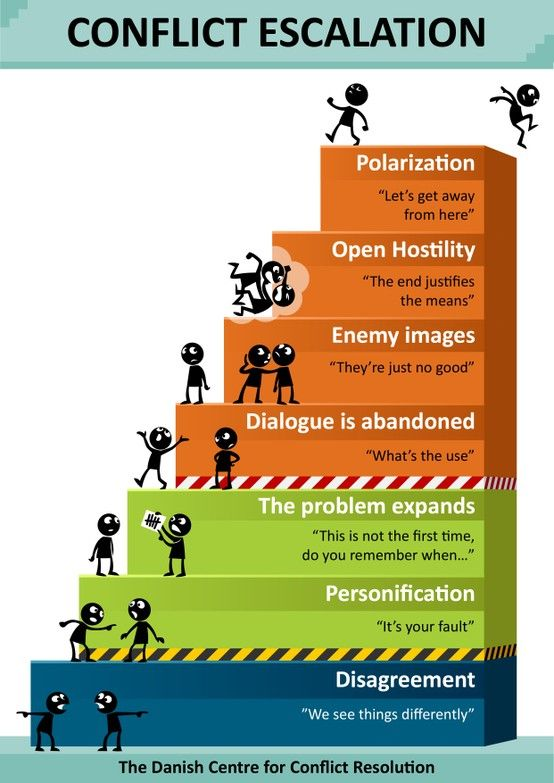
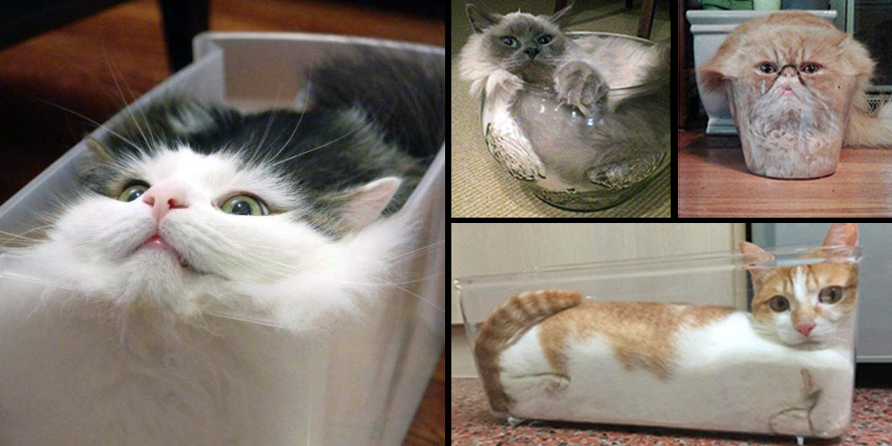

# Haneul

- Soft Robots
- Master Media Design + O2R

## Project title

<!-- Think a simple, straightforward title, can also be poetic or playful but keep it short. -->

**Felimo**

Felis(cat) + Felix(happy) + motus(emotion)

## Research Question / area of research

<!-- One or two sentences, describing questions that your project evokes. For example: "What new relationships can we have with traditional altars?" -->

1. How does your pet help calm your emotions?
2. What behavior of your pet most effectively lightens the mood during an argument?

## Pitch

<!-- One sentence to describe what is your concept. (~100 chars max) For example: "My project is a sound tapestry that records and transform human conversations".

- Key visual (from your 3D renderings or your paper prototypes)
- Optional second visual -->

My project is a playful and interactive distractor that defuse tension and support emotional well-being.

## Prototyping research

<!-- Describe in a short paragraph (~500 chars) the research that you have conducted around your prototypes. What were your intentions? What are the several forms you looked into? What were the different interactions you tried? Illustrate each method with corresponding photo, sketches, audio, movies, 3D visuals etc. You can put a lot of elements here, but please curate the most illustrative materials. -->

My initial concept was inspired by cats as mediators in conflicts by calming and interrupting fights. However, conflict is complex, and mere distraction can sometimes intensify it. I looked into conflict resolutions as well as conflict escalation models.

|  |  |
| :---------------------------------------------------: | :---------------------------------------------------: |

Later, I realized that beyond conflicts, cats offer emotional comfort in amusing ways. Inspired by how my cat interacts with me, I envisioned a robot that recognizes and responds to emotions, much like a cat does. In the end, inspired by **cats are liquid**, I created a wavy paper prototypes.

|  |  |  |
| ----------------------------------------------------- | ----------------------------------------------------- | ----------------------------------------------------- |

|  |  |  |
| ------------------------------------------------------ | ------------------------------------------------------ | ------------------------------------------------------ |

|  |  |  |
| ------------------------------------------------------ | ------------------------------------------------------ | ------------------------------------------------------ |

|  |  |
| ------------------------------------------------------ | ------------------------------------------------------ |

|  |  |
| ------------------------------------------------------ | ------------------------------------------------------ |

|  |  |  |  |
| ------------------------------------------------------ | ------------------------------------------------------ | ------------------------------------------------------ | ------------------------------------------------------ |

|  |  |
| ------------------------------------------------------ | ------------------------------------------------------ |

## Your key prototype

Short paragraph (~250 chars) describing the prototype and your concept, what it does, how does it act, why does it exist etc.

- One photo of the paper prototype (can be gif animation, or static)
- One 3D image
- (Optional) Audio
- (Optional) Video

## User scenario

- Your storyboard showing how your prototype can be used

## Next Steps

In one sentence, describe what you will focus on next.
