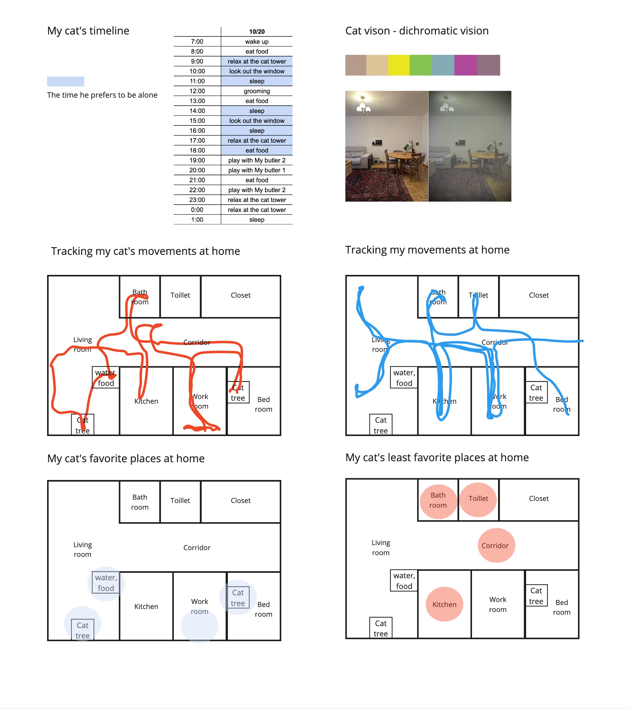
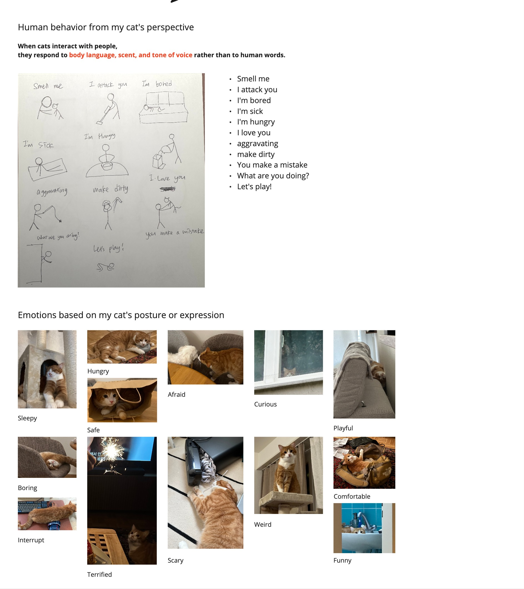
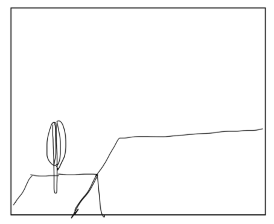
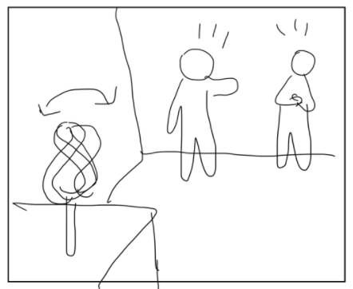
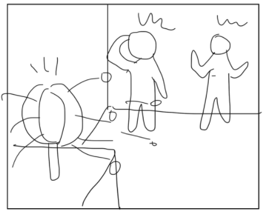
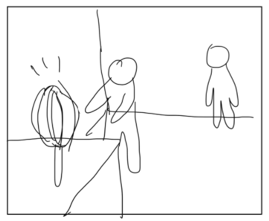
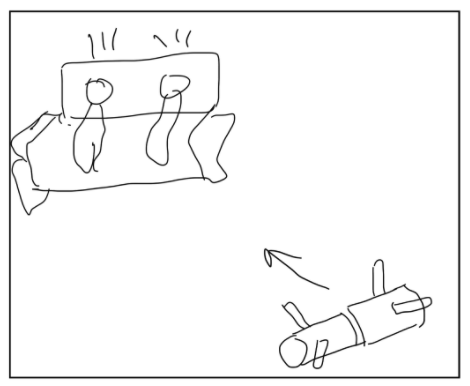
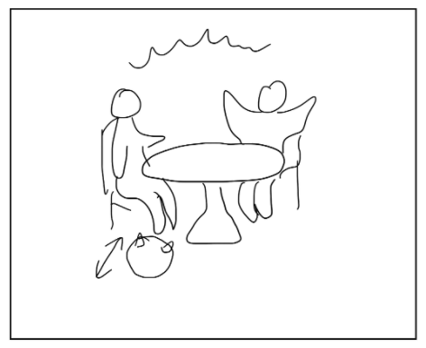

# Haneul

- Soft Robots
- Master Media Design + O2R

## Area of intervention

Promoting reconciliation and easing conflict through pet's behavior and interaction with people in the domestic space.

## Research Question

1. How does your pet help calm your emotions?
2. What behavior of your pet most effectively lightens the mood during an argument?

## Research

My research focuses on how pets can shift attention away from conflict and promote reconciliation between people. To explore this, I first observed pet behaviors, sounds, and their interactions with the surrounding environment. Additionally, based on these observations, I conducted surveys to gain insights into how pets can help in conflict resolution.

### Observations

### Survey

[Impact of Pets on Emotional Well-Being During Conflicts 🐶🐱](https://forms.gle/C8yAmCHGzU1D5PVu7)

1. **What behavior of your pet most effectively lightens the mood during an argument?**
   1. Rubbing against you
   2. Acting playfully
2. **What sound made by your pet lifts your spirits or relieves tension during a conflict?**
   1. Soft purring
   2. A soothing vocalization
3. **When your pet intervenes during a disagreement, what behavior helps ease the tension?**
   1. Sitting between people
4. **How does your pet help calm your emotions?**
   1. Approaching for affection
5. **When does your pet make you feel happy?**
   1. Cuddling with you during tough times
   2. Greeting you excitedly
6. **When you are angry, how does your pet's presence affect your feelings?**
   1. It calms me down
   2. It distracts me from my anger
7. **How important is your pet's behavior in resolving conflicts?**
   1. Somewhat important

## Insights

1. Pets can play the role of catalyst for resolving conflict in a couple
2. Creating an atmosphere of playful distraction can promote reconciliation between people

## First ideas & prototypes

### Messybot

When conflicts arise at home, this robot draws attention with vibrant movements and lights, releasing dust into the air. Alternatively, while people are arguing, the robot creates minor messes around the house to divert their attention and lighten the atmosphere.

|  |  |
| ------------------------------------------- | ------------------------------------------- |

| Order | Image                                                             | Description                                                              |
| ----- | ----------------------------------------------------------------- | ------------------------------------------------------------------------ |
| 1     |  | The robot is on the table, usually in power-saving mode.                 |
| 2     |  | Two people start arguing. The robot hears it and begins to spin.         |
| 3     |  | The robot keeps spinning, changes shape, and releases some dust.         |
| 4     |  | They stop arguing, approach the robot, and wait for it to stop the dust. |

---

### Rolly

By utilizing a cat's righting reflex, the robot rolls toward people in the household during conflict situations, showing amusing movements based on this reflex. This helps to divert attention and guide the situation toward conflict resolution.

|  |  |
| -------------------------------------------------- | --------------------------------------------------- |

| Order | Image                                                            | Description                                                   |
| ----- | ---------------------------------------------------------------- | ------------------------------------------------------------- |
| 1     |  | Two people start arguing in the living room.                  |
| 2     |  | The soft robot rolls between them, showing a righting reflex. |
| 3     |  | The robot's funny movements grab their attention.             |
| 4     |  | They forget the argument and share a laugh.                   |

---

### Mochi

Inspired by Schrödinger's cat, the robot usually operates in hidden mode, concealing its presence. During conflict, it transforms into bright and warm colors, approaching people to signal a shift from a state of “non-existence” to “existence.” Through light, vibration, and soft touch, it provides emotional comfort and helps ease tension.

|  |  |
| -------------------------------------------- | --------------------------------------------- |

| Order | Image                                                            | Description                                                                    |
| ----- | ---------------------------------------------------------------- | ------------------------------------------------------------------------------ |
| 1     |  | The robot usually stays hidden in a corner.                                    |
| 2     |  | Two people start arguing. The robot lights up and moves closer.                |
| 3     |  | When it detects someone, it tries a gentle touch.                              |
| 4     |  | The people are charmed by its look and touch. It purrs, making them feel calm. |

---

## Next Steps

I will conduct more research on how people resolve conflicts step-by-step, as my current prototypes mainly focus on distracting people from the conflict. I will also explore ways to make the robots more interactive and responsive to their environment
