# 2024-11-06

## Observations

## Research

  
Schrödinger's cat: a cat, a flask of poison, and a radioactive source connected to a Geiger counter are placed in a sealed box. As illustrated, the quantum description uses a superposition of an alive cat and one that has died.

## Idea Development

### **Why do I like my cat?**

- because I like that he is so fluffy and flexible, making me feel cozy when I touch him
- when I'm sad or depressed, petting and hugging him makes me feel better
- **sometimes, he even helps us to reconcile** ✅

### **Survey**

👉 How do pets help you to reconcile with others?

[Impact of Pets on Emotional Well-Being During Conflicts 🐶🐱](https://forms.gle/C8yAmCHGzU1D5PVu7)

1. **What behavior of your pet most effectively lightens the mood during an argument?**
   1. Rubbing against you
   2. Acting playfully
2. **What sound made by your pet lifts your spirits or relieves tension during a conflict?**
   1. Soft purring
   2. A soothing vocalization
3. **When your pet intervenes during a disagreement, what behavior helps ease the tension?**
   1. Sitting between people
4. **How does your pet help calm your emotions?**
   1. Approaching for affection
5. **When does your pet make you feel happy?**
   1. Cuddling with you during tough times
   2. Greeting you excitedly
6. **When you are angry, how does your pet's presence affect your feelings?**
   1. It calms me down
   2. It distracts me from my anger
7. **How important is your pet's behavior in resolving conflicts?**
   1. Somewhat important

## Concept

### Title

**Moodiator (or Moodie)** - A Soft Robot for Reconciliation

<!-- Mood meditator -->

### Single Phrase Summary

A soft robot that eases emotions and promotes reconciliation through gentle distractions.

### Keywords

- Interaction
  - Emotional Relief, Reconciliation, Playful Distraction
- Sensors
  - Audio Detection, Proximity Detection, Motion Detection
- Actuators
  - Gentle Vibration, Purring Sound, Soft Movement, Ambient Light
- Context
  - Domestic Conflict, Relationship Reconciliation, Calming Atmosphere

### Summary Paragraph

**Moodiator** is a domestic soft robot inspired by cats, designed to help defuse tense conversations and foster reconciliation between people. Just as cats often lighten the mood with playful distractions, affectionate gestures, this soft robot uses similar behaviors to help shift attention away from conflict, calm heightened emotions. By offering a comforting presence and engaging interactions, Moodiator create a more peaceful atmosphere in the home, supporting healthier relationships and emotional well-being.

## Paper Prototypes

### **Robot Using the Cat's Righting Reflex**

|  |  |
| ------------------------------ | ------------------------------- |

By utilizing a cat's righting reflex, the robot rolls toward people in the household during conflict situations, showing amusing movements based on this reflex. This helps to divert attention and make them to reconcile.

### **Schrödinger's Cat-Inspired Robot**

|  |  |
| ------------------------ | ------------------------- |

Inspired by Schrödinger's cat, the robot usually operates in hidden mode, concealing its presence. During conflict, it transforms into bright and warm colors, approaching people to signal a shift from a state of “non-existence” to “existence.” Through light, vibration, and soft touch, it provides emotional comfort and helps ease tension.

### **Robot Using Cat Tail Movements**

|  |  |
| ---------------------- | ---------------------- |

Based on the movements of a cat's tail, this robot sways its tail and approaches people during conflict situations, giving a soft vibration to help ease the tension. Just as a cat puffs up its tail when frightened, the robot sways its tail in times of conflict to convey a sense of calm and reassurance.

### **Messy Robot**

|  |  |
| ----------------------- | ----------------------- |

When conflicts arise at home, this robot draws attention with vibrant movements and lights, releasing dust into the air. Alternatively, while people are arguing, the robot creates minor messes around the house to divert their attention and lighten the atmosphere.

### failures

|  |  |  |
| -------------------------- | -------------------------- | -------------------------- |

## Storyboards

### **Robot Using the Cat's Righting Reflex**

| Order | Image                                        | Description                                                   |
| ----- | -------------------------------------------- | ------------------------------------------------------------- |
| 1     | 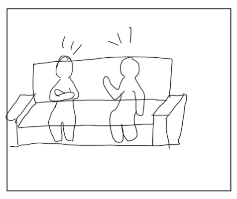 | Two people start arguing in the living room.                  |
| 2     | 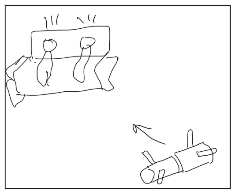 | The soft robot rolls between them, showing a righting reflex. |
| 3     | 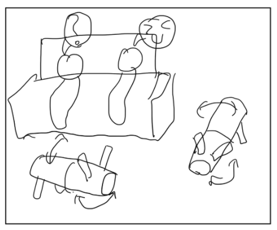 | The robot's funny movements grab their attention.             |
| 4     | 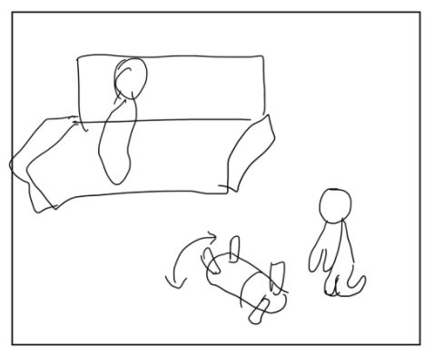 | They forget the argument and share a laugh.                   |

### **Schrödinger's Cat-Inspired Robot**

| Order | Image                                        | Description                                                                    |
| ----- | -------------------------------------------- | ------------------------------------------------------------------------------ |
| 1     | 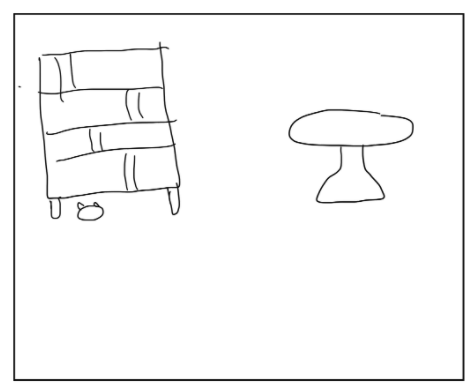 | The robot usually stays hidden in a corner.                                    |
| 2     | 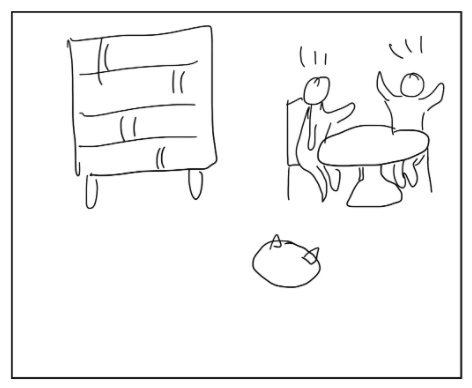 | Two people start arguing. The robot lights up and moves closer.                |
| 3     | 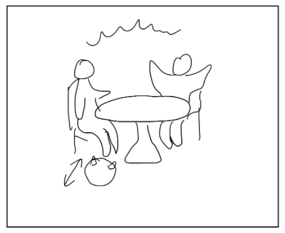 | When it detects someone, it tries a gentle touch.                              |
| 4     | 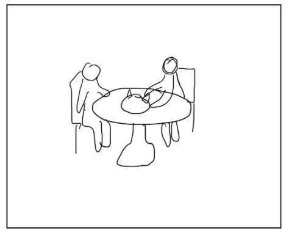 | The people are charmed by its look and touch. It purrs, making them feel calm. |

### **Robot Using Cat Tail Movements**

| Order | Image                                         | Description                                                                  |
| ----- | --------------------------------------------- | ---------------------------------------------------------------------------- |
| 1     | 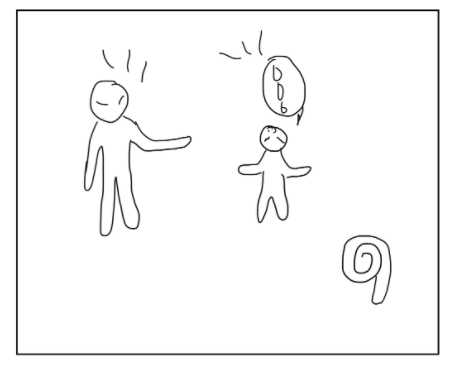  | The robot looks like a cat’s tail, usually curled up.                        |
| 2     | 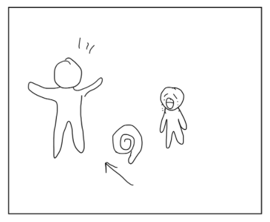 | A mother starts scolding her child, who cries. The robot moves between them. |
| 3     | 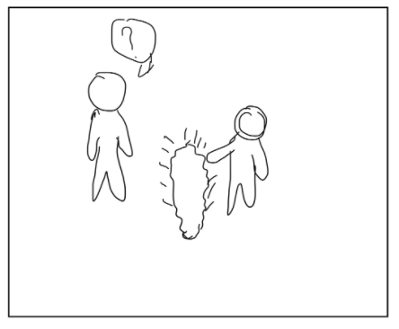 | Between them, the robot straightens, vibrates softly, and expands a bit.     |
| 4     | 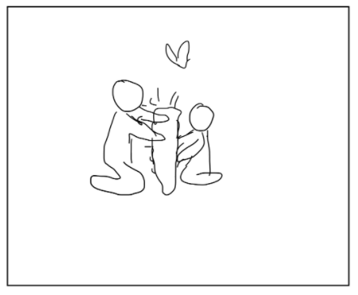 | They notice the robot’s funny movements, touch it, and pause the argument.   |

### **Messy Robot**

| Order | Image                                         | Description                                                              |
| ----- | --------------------------------------------- | ------------------------------------------------------------------------ |
| 1     | 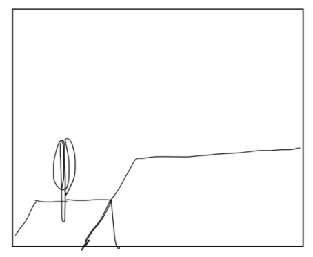 | The robot is on the table, usually in power-saving mode.                 |
| 2     | 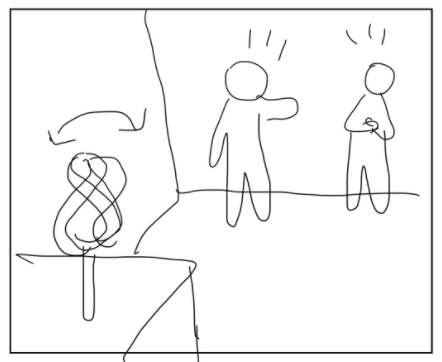 | Two people start arguing. The robot hears it and begins to spin.         |
| 3     | 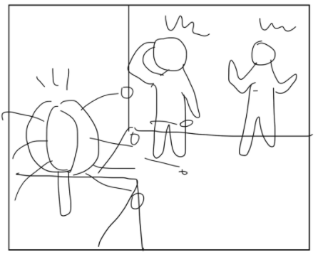 | The robot keeps spinning, changes shape, and releases some dust.         |
| 4     | 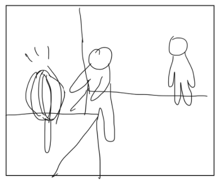 | They stop arguing, approach the robot, and wait for it to stop the dust. |

---

<!-- it’s essential to start from the interaction: What will the defining interaction and gesture be? How will your robot communicate with its surroundings? Do not worry too much about technical possibilities at the moment.

For the presentation on November 6th, we would like you to prepare the following items:

1. A brief summary of your observations and field research (you can use your GitHub for this).
A title
A single phrase summarizing your idea in a few words
A few keywords (can be around the interaction, your sensor, your actuator, your robot’s intention, your context…)
A short paragraph summarizing your idea so far
1. A series of paper prototypes, including examples of what did not work. At least 4 !
2. At least three storyboards that illustrate how your prototypes can be used. These can include different storyboards for various prototypes or different variations of a single idea. -->
