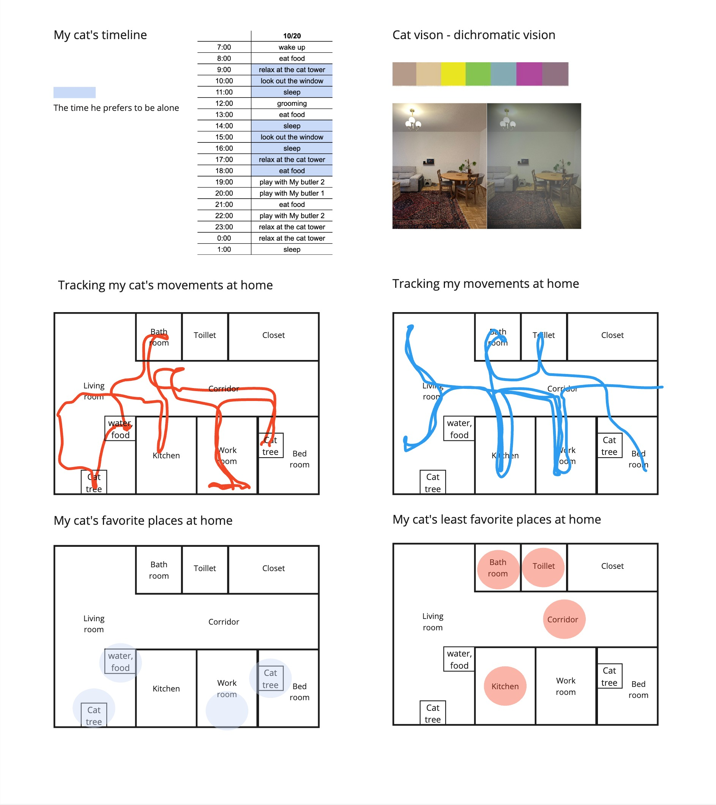
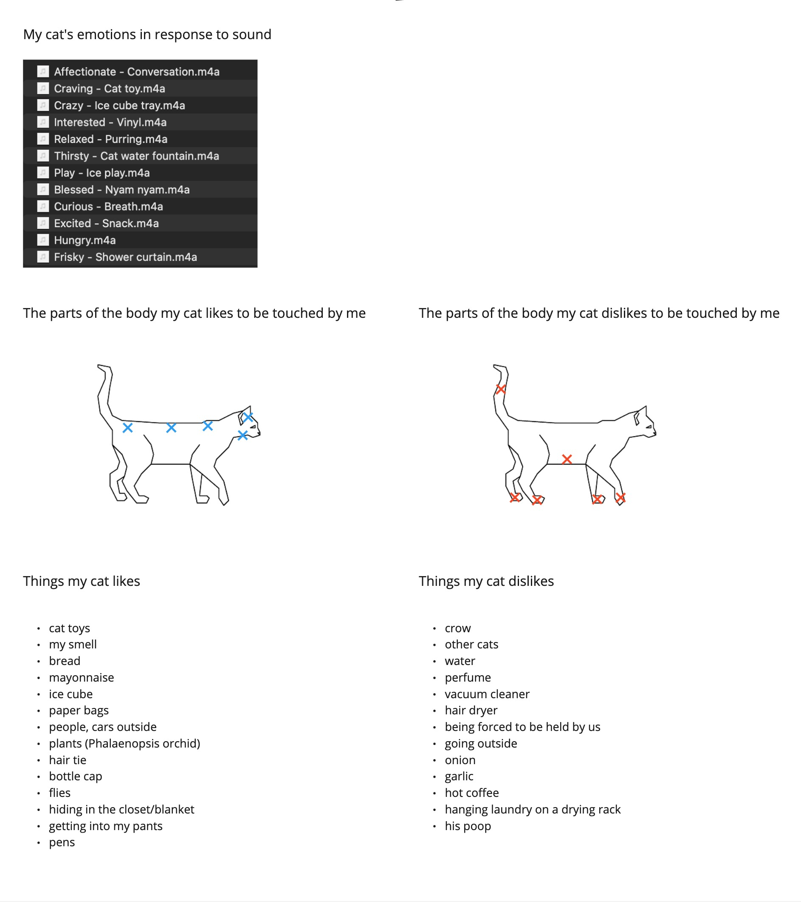
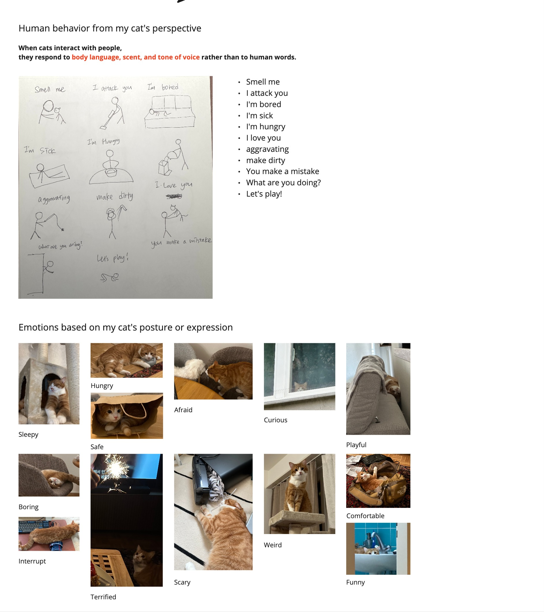
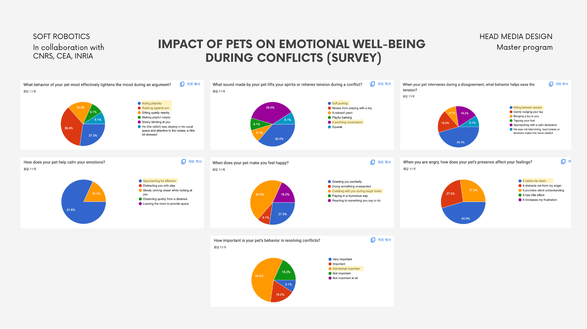

# 2024-11-06

## Observations & Field Research

### 1. Observations

### 2. Research

### 3. Idea Development

**Why do you like cats?**

- because I like that they are fluffy and flexible so I can feel more cozy when I touch them
- when I'm sad or depressed, I want to pet them and hug them in order to make it feel better
- **sometimes, he helps us to reconcile** ✅

**Survey**

👉 How do pets help you to reconcile with others?

[Impact of Pets on Emotional Well-Being During Conflicts 🐶🐱](https://forms.gle/C8yAmCHGzU1D5PVu7)

#### 1. Title

**"Moodiator (or Moodie): A Soft Robot for Reconciliation"**

<!-- Mood meditator -->

#### 2. Single Phrase Summary

"A soft robot that eases emotions and fosters reconciliation by offering gentle distractions."

#### 3. Keywords

- **Interaction**: Emotional Relief, Reconciliation, Playful Distraction
- **Sensors**: Audio Detection, Proximity Detection, Motion Detection
<!-- - **Actuators**: Light Blinking, Gentle Vibration, Nuzzling Motion, Paw Tapping -->
- **Robot’s Intention**: De-escalation, Emotional Soothing, Engaging Distraction
- **Context**: Domestic Conflict, Relationship Reconciliation, Calming Atmosphere

#### 4. Summary Paragraph

**Moodiator** is a domestic soft robot inspired by the calming influence of cats, designed to help defuse tense conversations and foster reconciliation between people. Just as cats often lighten the mood with playful distractions, affectionate gestures, or a gentle nuzzle, this soft robot uses similar behaviors to de-escalate emotions. The robot provides subtle, non-verbal cues that help shift attention away from conflict, ease heightened emotions, and ultimately guide people toward a calmer, more balanced state of mind. By offering a comforting presence and engaging interactions, Moodiator aims to create a more harmonious atmosphere in the home, supporting healthier relationships and emotional well-being.

<!-- it’s essential to start from the interaction: What will the defining interaction and gesture be? How will your robot communicate with its surroundings? Do not worry too much about technical possibilities at the moment.

For the presentation on November 6th, we would like you to prepare the following items:

1. A brief summary of your observations and field research (you can use your GitHub for this).
A title
A single phrase summarizing your idea in a few words
A few keywords (can be around the interaction, your sensor, your actuator, your robot’s intention, your context…)
A short paragraph summarizing your idea so far
1. A series of paper prototypes, including examples of what did not work. At least 4 !
2. At least three storyboards that illustrate how your prototypes can be used. These can include different storyboards for various prototypes or different variations of a single idea. -->
