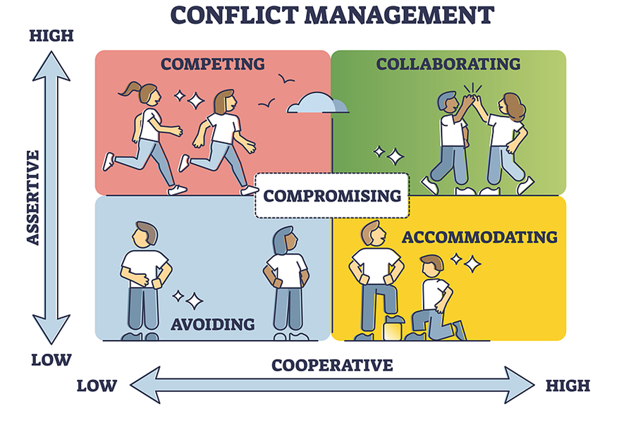
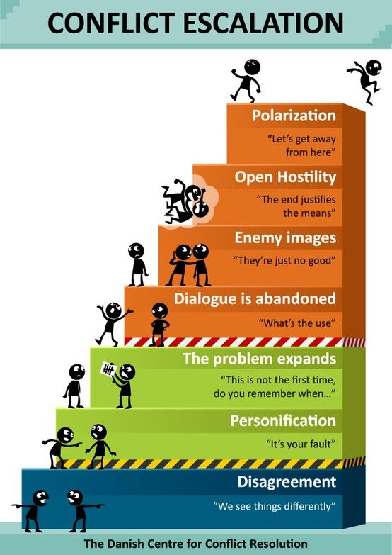
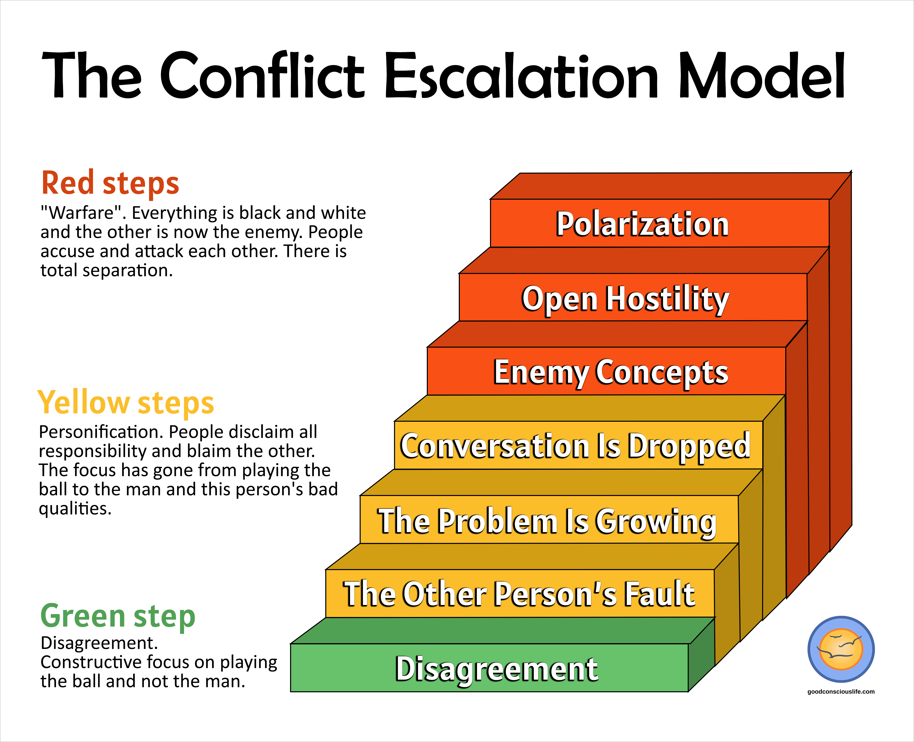
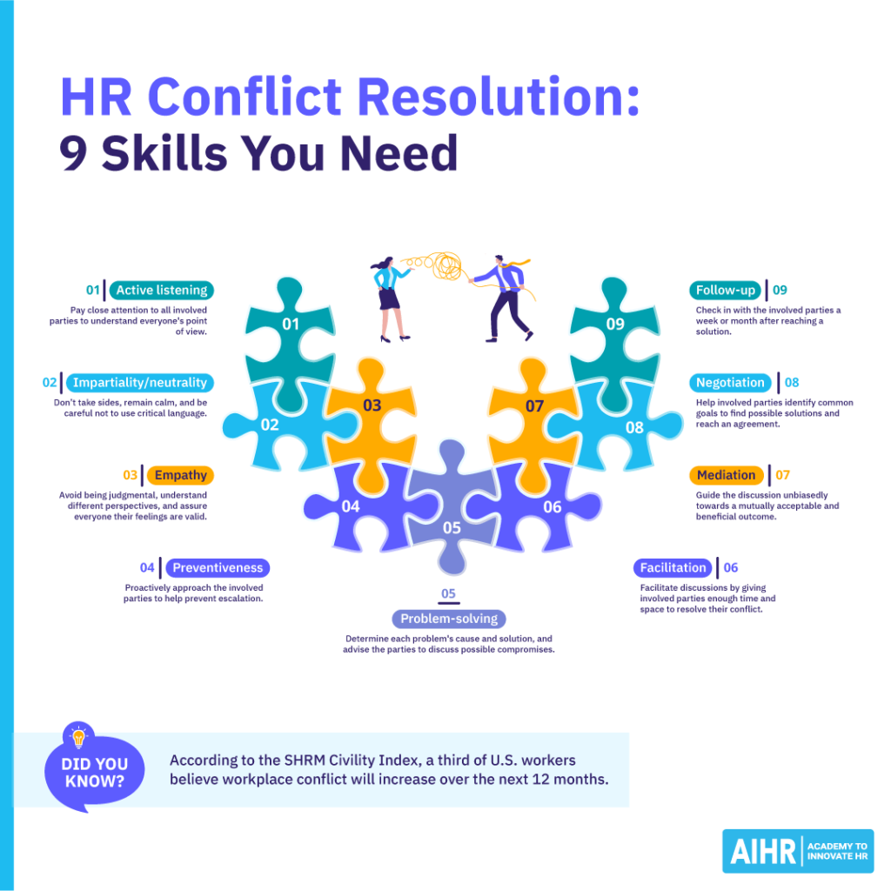
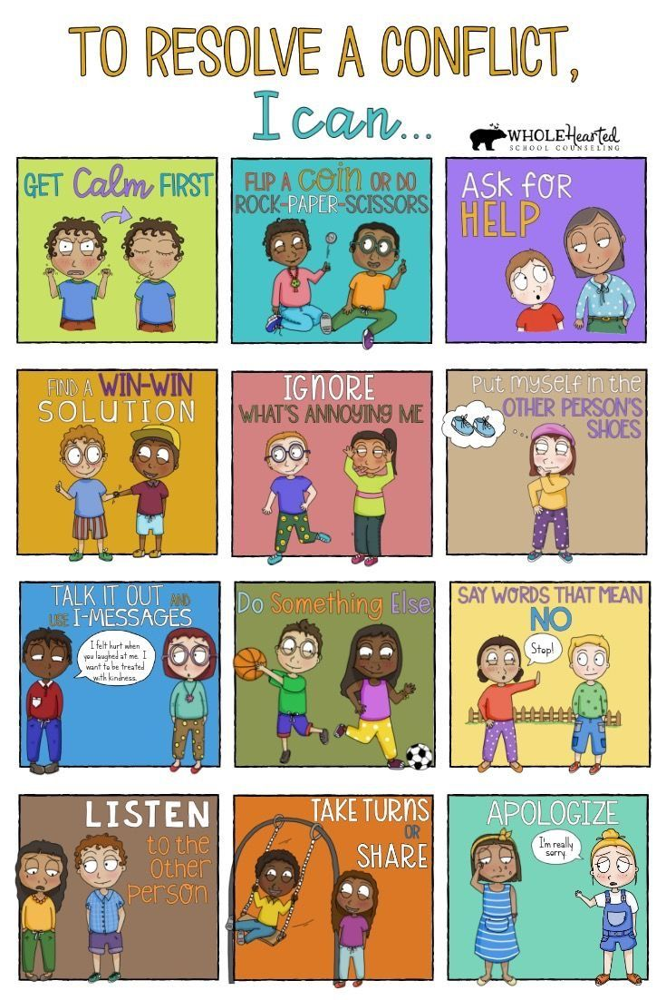
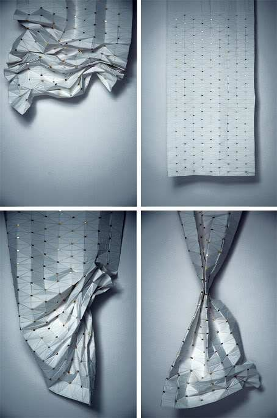
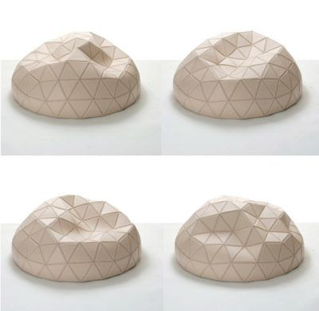
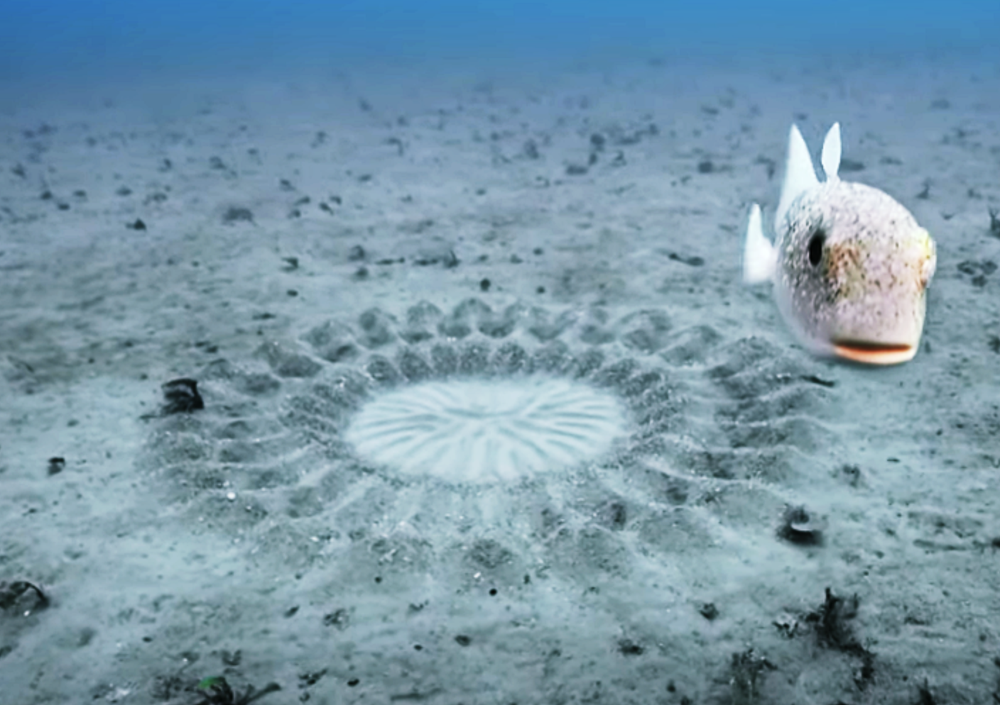

# 2024-11-11

- [x] reading 'Cats are liquid' article
- [x] watching Sunny TV series
- [x] researching conflict resolution techniques
- [ ] different types of aspects of conflicts including distraction strategies, listening
- [ ] collection of prototypes from calming to annoying
- [ ] AI used for therapy debates

## Conflict research

### **Thomas Kilmann Conflict Management Model**

The **Thomas-Kilmann Conflict Management Model** describes different ways to handle conflict, developed by psychologists Kenneth Thomas and Ralph Kilmann. The model categorizes conflict behavior into five main styles based on two key dimensions: **Assertiveness** (the degree to which one pursues their own concerns) and **Cooperativeness** (the degree to which one seeks to satisfy others' concerns).

#### 1. **Competing**

- **Description**: This style involves assertively pursuing one's own goals or interests, often at the expense of others. It emphasizes winning and can be effective when quick, decisive action is needed.
- **Characteristics**:
  - High **assertiveness** and low **cooperativeness**.
  - Useful for situations requiring quick decisions or where important issues are at stake but can damage relationships if overused.

#### 2. **Collaborating**

- **Description**: This style seeks to find a solution that satisfies all parties involved. It involves exploring the underlying issues, considering everyone’s needs, and working together to achieve the best outcome.
- **Characteristics**:
  - High **assertiveness** and high **cooperativeness**.
  - Effective for building trust and strengthening relationships but can be time-consuming.

#### 3. **Compromising**

- **Description**: This approach involves finding a middle ground where each party gives up something to reach a mutually acceptable solution. It often provides a quick, pragmatic resolution.
- **Characteristics**:
  - Moderate **assertiveness** and **cooperativeness**.
  - Suitable for resolving conflicts quickly, but it may not fully satisfy either party in the long run.

#### 4. **Avoiding**

- **Description**: This style involves sidestepping or ignoring the conflict without directly addressing it. It may be used when the conflict is trivial or when addressing it may not be worth the effort.
- **Characteristics**:
  - Low **assertiveness** and low **cooperativeness**.
  - Useful when waiting for a better time to address the issue or when the conflict is insignificant, but can lead to unresolved problems if used too often.

#### 5. **Accommodating**

- **Description**: This approach focuses on meeting the needs of the other party while often sacrificing one's own interests. It is used to maintain harmony or prioritize the satisfaction of others.
- **Characteristics**:
  - Low **assertiveness** and high **cooperativeness**.
  - Effective for preserving or enhancing relationships but can lead to resentment if one consistently gives up their own needs.

### Conflict escalation

[The conflict escalation model](https://www.goodconsciouslife.com/conflict-escalation-model)

|  |  |
| --------------------------------- | -------------------------------------------- |

### Conflict resolution

|  |  |
| :-------------------------------: | :-------------------------------: |

## Prototypes

### 1. A robot that gets distorted when parties are in conflict, reflecting the intensity of the situation.

|  |  |  |
| ------------------------------- | --------------------------------- | --------------------------------- |

### 2. A robot that helps you understand other people's perspectives by showing different viewpoints.

https://vimeo.com/89556173

<video width="640" height="360" controls>
  <source src="https://vimeo.com/89556173" type="video/mp4">
  Your browser does not support the video tag.
</video>

- [The Machine To Be Another](https://miro.com/app/board/uXjVLQwwNbQ=/?moveToWidget=3458764606171108884&cot=14)
- [Remote Pulse - Rafael Lozano-hemmer](https://www.lozano-hemmer.com/remote_pulse.php)

### 3. A robot that increase intimacy with others

[Touch](https://www.studioroosegaarde.net/project/touch)

### 4. A robot that gives people who avoid conflict a chance to speak their mind without confrontation.

[Pufferfish builds sand sculpture for mating](https://sputnik.kr/news/view/7226)

