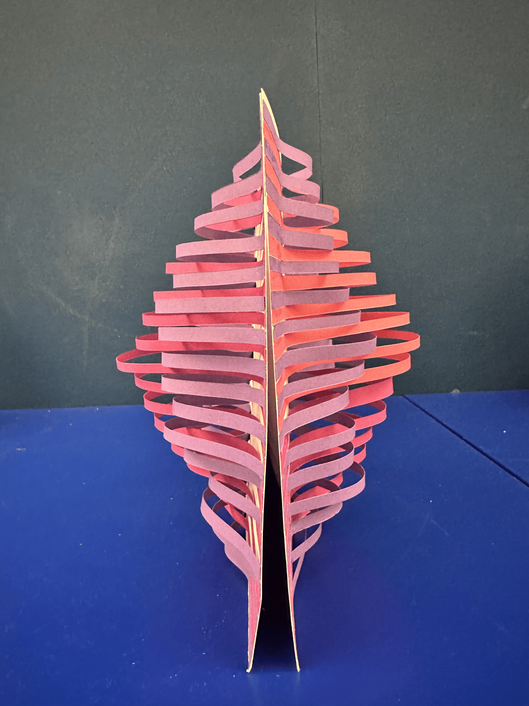

# 2024-11-14

## Feedback & Plan

Cats may seem passive, but they are asking for attention. They just bring other emotions to you. It doesn't have to be when we are fithing with someone. Cats sleep all day but when they see you arrive and start being active. I plan to create prototypes that showcase different responses based on sound volume, using folding and weaving techniques.

## Rhino practice

|  |  |
| --------------------------------- | --------------------------------- |

## Reference

## Prototypes

### Prototype 1

A flexible paper prototype with simple lines. It has volume but is a bit fragile.

|  |  |  |
| ---------------------------------- | ---------------------------------- | ---------------------------------- |

### Prototype 2

A prototype with small cylinders. We can fold or turn them to create different shapes. The third photo here shows a 3D shape made with cone-shaped cylinders.

|  |  |  |
| ---------------------------------- | ---------------------------------- | ---------------------------------- |

### Prototype 3

I was inspired by the article ‘Cats are Liquids’ and created a prototype resembling a water wave. The wave shape of each line is different to create a unique 3D form.

|  |  |
| ---------------------------------- | ---------------------------------- |

Next, I removed the paper in the middle that supported the wave shape on both sides and fixed it with a wooden stick. However, the 3D shape is not very visible in this version.

|  |  |
| ---------------------------------- | ---------------------------------- |

### Prototype 4

The final prototype is designed to gradually increase in volume, creating a spherical 3D shape.

|  |  |  |
| ---------------------------------- | ---------------------------------- | ---------------------------------- |

Next, I added gradual volume and different wave shapes to each line to create a 3D form resembling a living creature.

|  |  |  |
| ---------------------------------- | ---------------------------------- | ---------------------------------- |

This design is a combination of different wavy shapes.

|  |  |  |
| ---------------------------------- | ---------------------------------- | ---------------------------------- |

Finally, these two prototypes can be combined to create the final shape. We can add different colors or wave patterns to each line to make it more interesting.

|  |  |
| ---------------------------------- | ---------------------------------- |

|  |  |
| ---------------------------------- | ---------------------------------- |

This is a different version of the final prototype. I attached different wave shapes onto the hemisphere-shaped structure.

|  |  |
| ---------------------------------- | ---------------------------------- |

### Behaviors

| Order | Volume level | Behaviors                                                                               |
| ----- | ------------ | --------------------------------------------------------------------------------------- |
| 1     | None         | When there is no sound, it doesn't move at all (sleep mode)                             |
| 2     | Small        | When a small sound is heard, its individual wave shapes start to move and undulate.     |
| 3     | Big          | As the sound gets louder, its middle surface will undulate and move just like swimming. |
