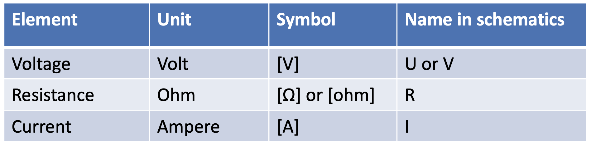
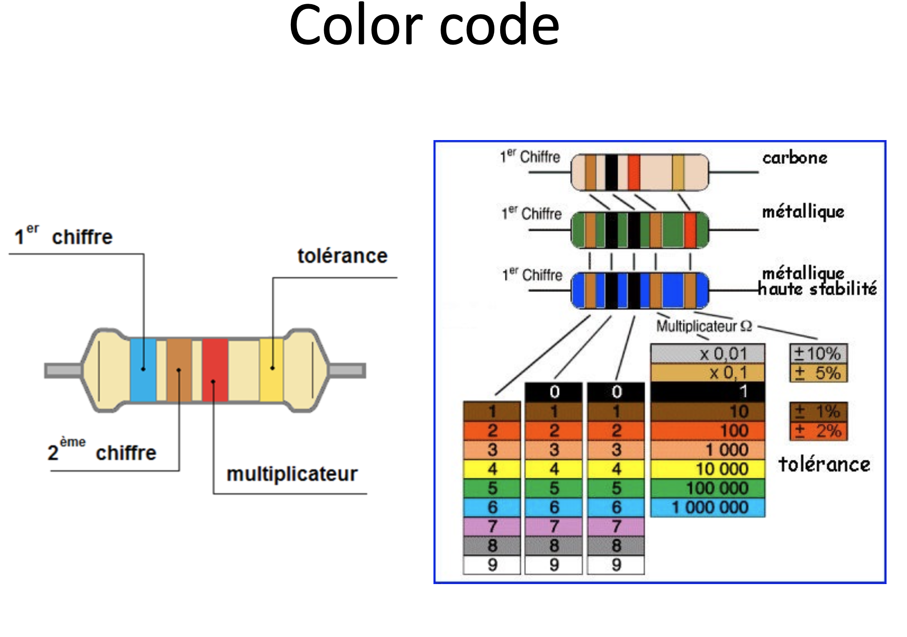
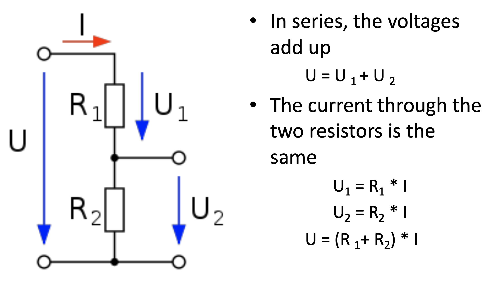
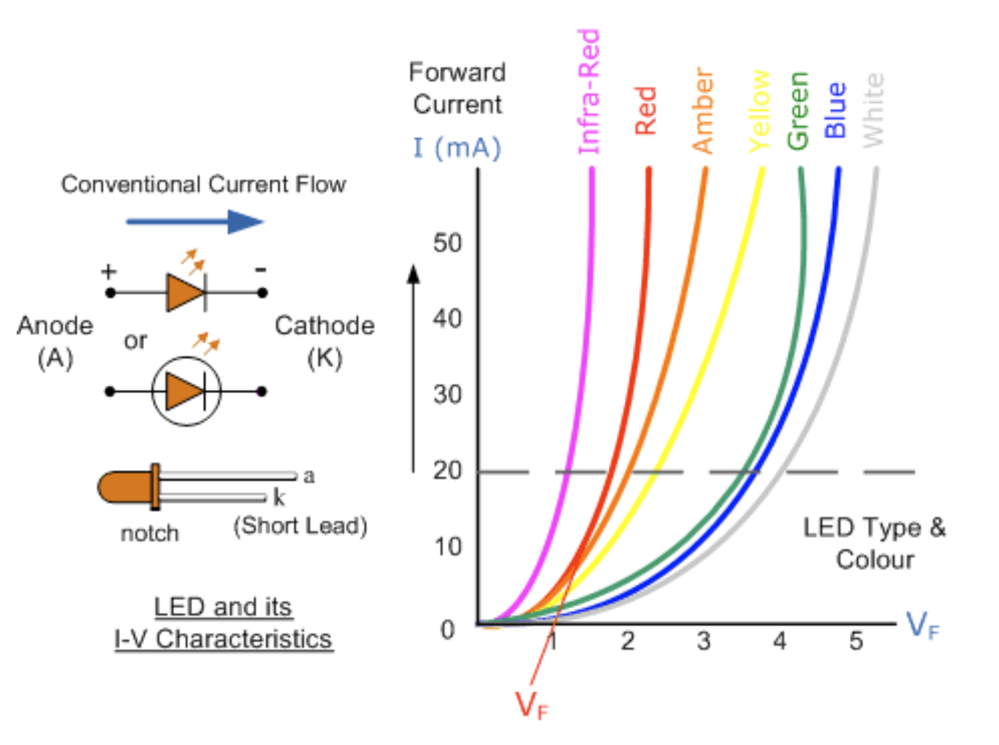
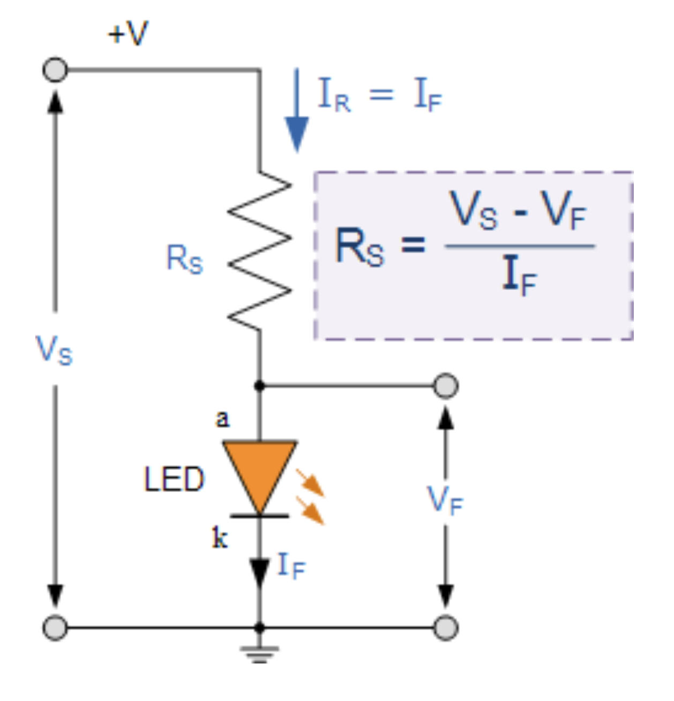

# 2024-11-18

## Electronics


### Resistor

- A voltage across a resistor causes a current to flow through it.
- The higher the resistance, the lower the current.
- The higher the voltage, the higher the current.



#### Resistor color code

- The color code is used to identify the resistance value of a resistor.
- The color code consists of three or four colored bands.
- The first two bands represent the first two digits of the resistance value.
- The third band represents the multiplier.
- The fourth band represents the tolerance.
- The resistance value is calculated using the formula: Resistance = (Digit1 \* 10 + Digit2) \* Multiplier



### Open circuit

- An open circuit is a circuit where there is a break in the path.
- No current flows through an open circuit.
- An open circuit can be caused by a broken wire or an open switch.

### Short circuit

- A short circuit is a circuit where there is a low resistance path.
- A short circuit can cause a large current to flow.
- A short circuit can be caused by a wire touching another wire or a wire touching a metal part.

### Multimeter

- A multimeter is a device that can measure voltage, current, and resistance.

### Ohm's law

- Ohm's law states that the current through a conductor between two points is directly proportional to the voltage across the two points.

```math
  Voltage (V) = Current (I) \* Resistance (R)
```

#### Exercise

On a 12v battery, we power a bulb that is 220 ohms. How much current is flowing through the bulb?

```math
Voltage (V) = 12v
Resistance (R) = 220 ohms

Current (I) = Voltage (V) / Resistance (R)
Current (I) = 12v / 220 ohms
Current (I) = 0.0545 A
Current (I) = 54.5 mA
```

### Joule's law

- Joule's law states that the power dissipated in a resistor is equal to the product of the current through the resistor and the voltage across the resistor.

```math
  Power (P) = Current (I) \* Voltage (V)
  Power (P) = Current (I)^2 \* Resistance (R)
  Power (P) = Voltage (V)^2 / Resistance (R)
```

#### Exercise

On a 12v battery, we power a 220 ohm bulb. How much power is dissipated in the bulb?

```math
Voltage (V) = 12v
Resistance (R) = 220 ohms

Power (P) = Voltage (V)^2 / Resistance (R)
Power (P) = 12v^2 / 220 ohms
Power (P) = 0.6545 W
```

### Voltage divider

- A voltage divider is a circuit that divides the input voltage into two or more output voltages.
- The output voltage is determined by the ratio of the resistances in the circuit.



#### Exercise

Using a voltage divider, I want to go from 12v to 4v across a 1k resistor(R2). What value should the other resistor(R1) have?

```math
Voltage (V) = 12v
Output Voltage (Vout) = 4v
Resistance (R2) = 1k

Vout = Vin \* (R2 / (R1 + R2))
4v = 12v \* (1k / (R1 + 1k))
4v = 12v \* 1k / (R1 + 1k)
4v = 12k / (R1 + 1k)
4v \* (R1 + 1k) = 12k
4v \* R1 + 4k = 12k
4v \* R1 = 8k
R1 = 8k / 4v
R1 = 2k
```

### LED (Light Emitting Diode)

- An LED is a semiconductor device that emits light when current flows through it.
- An LED has a positive and negative terminal.
- An LED has a forward voltage drop.




```math
Rs = (Vs - Vf) / If
```

#### Exercise

Using a 12v battery, I want to power an LED that has a voltage drop of 3v with a current of 20mA. What value should the resistor have?

```math
Voltage (Vs) = 12v
Forward Voltage (Vf) = 3v
Current (If) = 20mA

Rs = (Vs - Vf) / If
Rs = (12v - 3v) / 20mA
Rs = 9v / 20mA
Rs = 450 ohms
```
