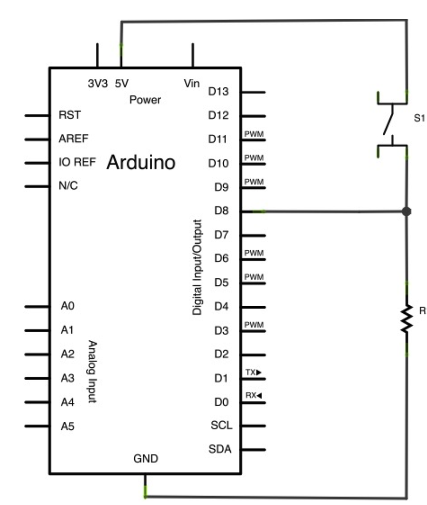

# 2024-11-19

## Arduino

- Arduino is an open-source electronics platform based on easy-to-use hardware and software.
- Arduino boards are able to read inputs - light on a sensor, a finger on a button, or a Twitter message - and turn it into an output - activating a motor, turning on an LED, publishing something online.

|  |  |
| ---------------------------------- | ---------------------------------- |

### Input

- digitalRead(pin) - Reads the value from a specified digital pin, either HIGH or LOW. (13)
- analogRead(pin) - Reads the value from the specified analog pin. (6)
- Serial.begin(speed) - Sets the data rate in bits per second (baud) for serial data transmission.
- Serial.println(value) - Prints data to the serial port as human-readable ASCII text followed by a carriage return character (ASCII 13, or '\r') and a newline character (ASCII 10, or '\n').
- delay(ms) - Pauses the program for the amount of time (in milliseconds) specified as a parameter.

### Output

- pinMode(pin, mode) - Configures the specified pin to behave either as an input or an output.
- digitalWrite(pin, value) - Write a HIGH or a LOW value to a digital pin. (13)

### Exercise

#### Turn on an LED

```arduino
#define LED_PIN 13

void setup() {
  pinMode(LED_PIN, OUTPUT);
  digitalWrite(LED_PIN, HIGH);
}

void loop() {
}
```

#### Turn on an LED for 1 second

```arduino
#define LED_PIN 13

void setup() {
  pinMode(LED_PIN, OUTPUT);
}
void loop() {
  digitalWrite(LED_PIN, HIGH);
  delay(1000);
  digitalWrite(LED_PIN, LOW);
  delay(1000);
}
```

### Pull-down

- A pull-down resistor is used to ensure that an input pin is LOW when the switch is open.
- When the switch is closed, the input pin is connected to Vcc and reads HIGH.
- When the switch is open, the pull-down resistor connects the input pin to GND and reads LOW.
- The pull-down resistor is connected between the input pin and GND.
- The value of the pull-down resistor is usually 10k ohms.



### Pull-up

- A pull-up resistor is used to ensure that an input pin is HIGH when the switch is open.
- When the switch is closed, the input pin is connected to GND and reads LOW.
- When the switch is open, the pull-up resistor connects the input pin to Vcc and reads HIGH.
- The pull-up resistor is connected between the input pin and Vcc.
- The value of the pull-up resistor is usually 10k ohms.


Arduino has built-in pull-up resistors that can be enabled using the **INPUT_PULLUP** mode. No need to add an external resistor.

```arduino
#define BUTTON_PIN 8

void setup() {
  pinMode(BUTTON_PIN, INPUT_PULLUP);
}

void loop() {
  boolean buttonState = digitalRead(BUTTON_PIN);
  Serial.println(buttonState);
}
```

### Serial communication

- Serial communication is a way to send data between the Arduino board and a computer.
- The Arduino board has a built-in Serial library that allows you to communicate with the board using a USB cable.
- The Serial library includes functions for sending data to the computer and receiving data from the computer.

```arduino
#define BUTTON_PIN 8

void setup() {
  pinMode(BUTTON_PIN, INPUT_PULLUP);
  Serial.begin(9600); // initialize serial communication at 9600 bits per second
}

void loop() {
  boolean buttonState = digitalRead(BUTTON_PIN);
  Serial.println(buttonState);
}
```

### Dimmer with button

```arduino
#define LED_PIN 13
#define BUTTON_PIN 8

float brightness = 5;
boolean goingUp = true;

void setup() {
  pinMode(BUTTON_PIN, INPUT_PULLUP);
  pinMode(LED_PIN, OUTPUT);

  // Serial.begin(9600);
}

void loop() {

  boolean buttonState = digitalRead(BUTTON_PIN);

  if(buttonState == LOW){
    if (goingUp) {
      brightness += 0.1;
      if (brightness > 20){
        brightness = 0;
      }
    } else {
      brightness -= 0.1;
      if (brightness < 0){
        brightness = 20;
      }
    }
  } else {
    goingUp = !goingUp;
  }

  digitalWrite(LED_PIN, true);
  delay(floor(brightness));
  digitalWrite(LED_PIN, false);
  delay(floor(20 - brightness));

  // Serial.println(buttonState);
  // //Serial.println
  // digitalWrite(LED_PIN, buttonState);
}
```

### SOS

```arduino
#define LED_PIN 13

void setup() {
  pinMode(LED_PIN, OUTPUT);
}

void loop() {
  for (int i = 0; i < 3; i++) {
    ti();
  }
  delay(400);
  for (int i = 0; i < 3; i++) {
    ta();
  }
  delay(400);
  for (int i = 0; i < 3; i++) {
    ti();
  }
  delay(4000);

}

void ti() {
  digitalWrite(LED_PIN, HIGH);
  delay(200);
  digitalWrite(LED_PIN, LOW);
  delay(200);
}

void ta() {
  digitalWrite(LED_PIN, HIGH);
  delay(400);
  digitalWrite(LED_PIN, LOW);
  delay(400);
}
```
