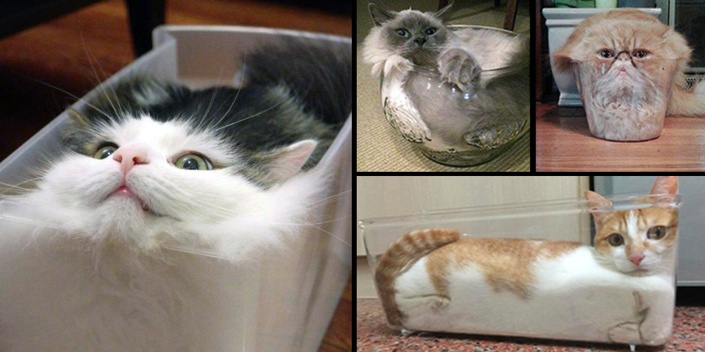
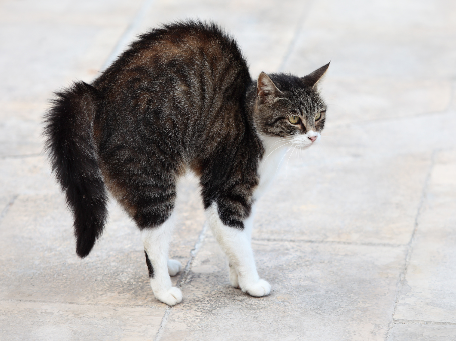
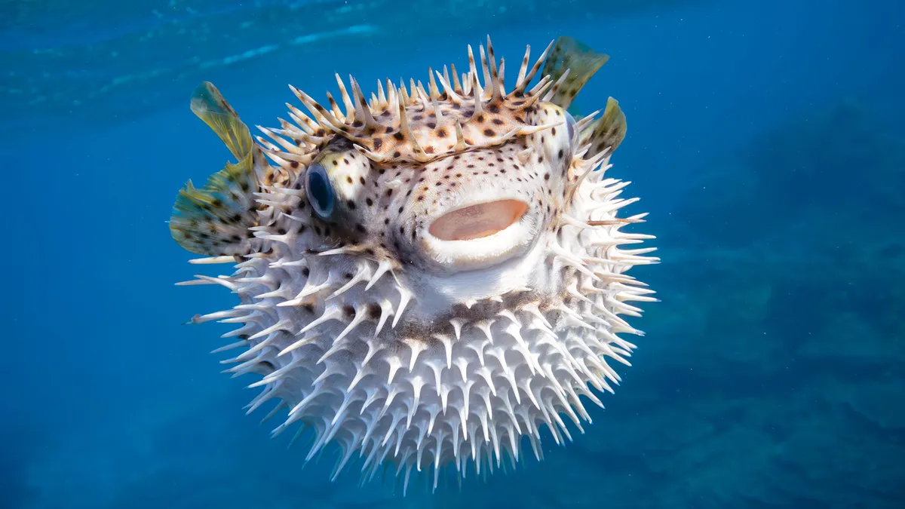
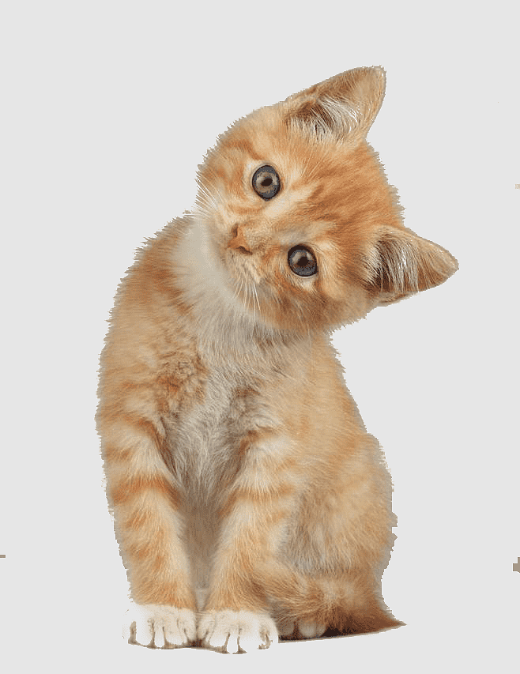
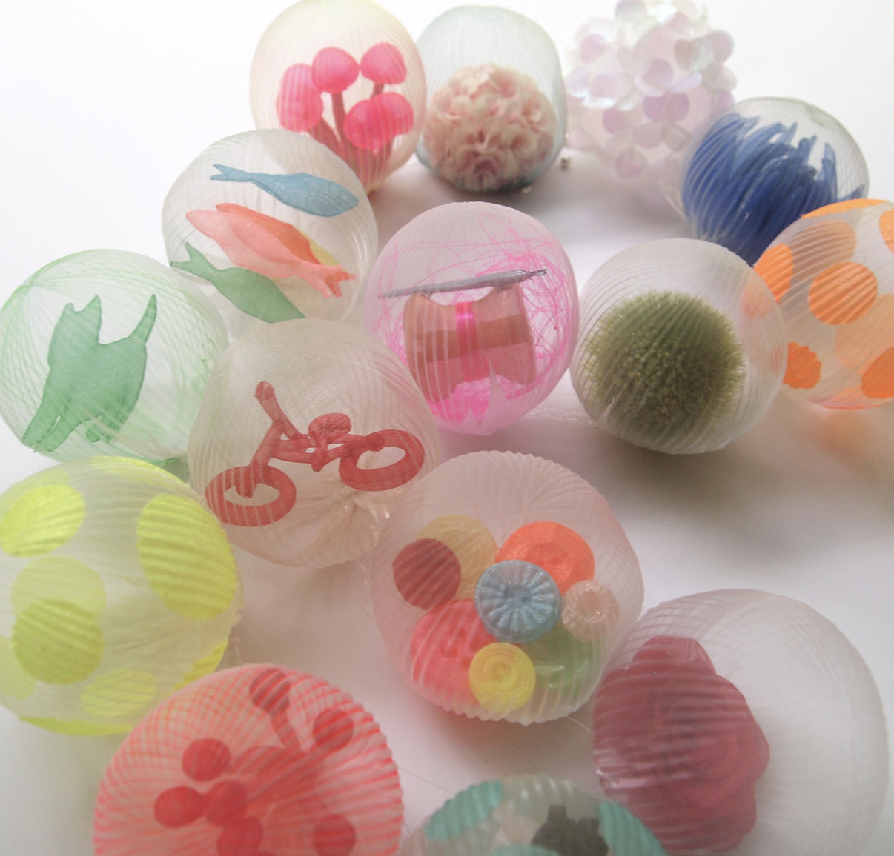
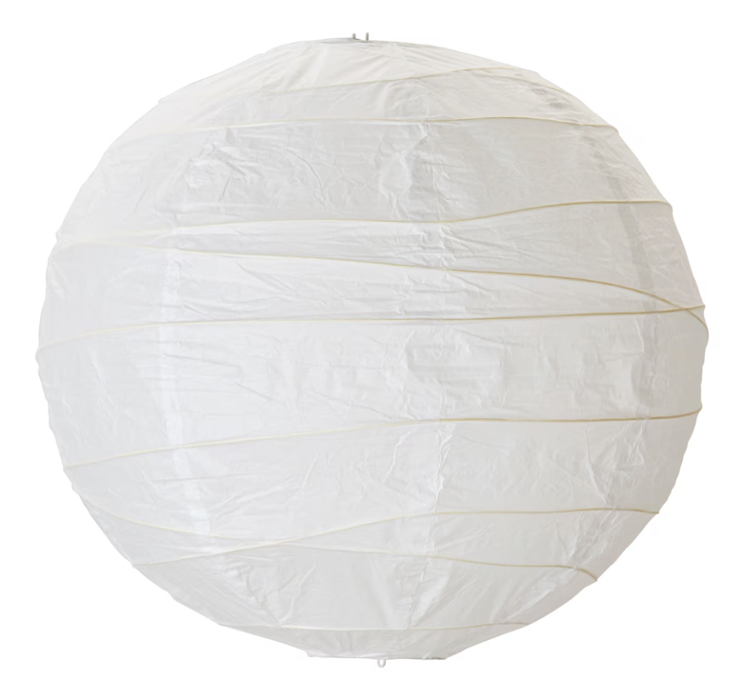

# 2024-11-20

## Concept (~ing)

This soft robot isn't just about fighting, they can create a variety of effects while getting people's attention.
For example, digital detox or sensory healing.
Fire-watching offers a rich sensory experience through its warmth, sound, and light. Water-watching stimulates the senses with the sounds of water, shimmering reflections, and its steady flow, providing a healing effect. Scientific studies have shown that simply listening to the sound of water can lower heart rates and alleviate stress.

## Final Shape

- Basically, at first the robot is very flat.
- When it detects small sounds, it will undulate like a wave.
- When it detects loud sounds, it gradually increases in volume, creating a spherical 3D shape just like a pufferfish inflates itself like a balloon when it senses danger, cats as well.
- When a person approaches the robot, it tilts left and right alternately. Just like a cat tilts its head when curious about something.

|  |  |  |  |
| --------------------------------- | --------------------------------- | --------------------------------- | --------------------------------- |

### Materials

1. Craft paper or Rice paper
2. Silicone rubber

### Movement

1. It can be bent to the left or right.
2. It can undulate like a wave.
3. It can be bigger or smaller.

<!-- https://vimeo.com/1031874144 -->

### Reference

https://www.marikokusumoto.com/fiber
  
[Ikea Rice paper lamp](https://www.ikea.com/ch/fr/p/regolit-abat-jour-suspension-blanc-fait-main-70103410/?extProvId=5&extPu=14231-gaw&extLi=21790054536&extCr=167369702086-716529685152&keyword=&extSi=&gad_source=1&gclid=CjwKCAiArva5BhBiEiwA-oTnXbvh_Qtlw4BhEQ_sFHDZIjf8TGo0EBOq4BcCxInxWiEMZFJZD8BQlxoCZckQAvD_BwE)

## Interaction

### Input

1. Sound
2. Movement

### Output

1. Sound
2. Movement
3. Light?
