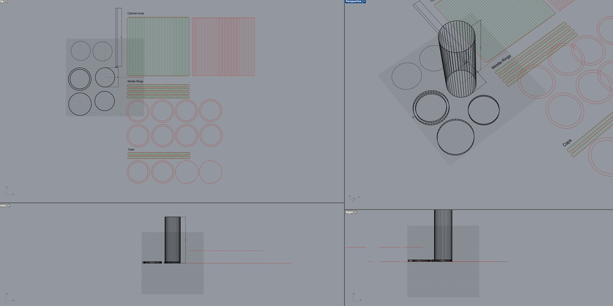
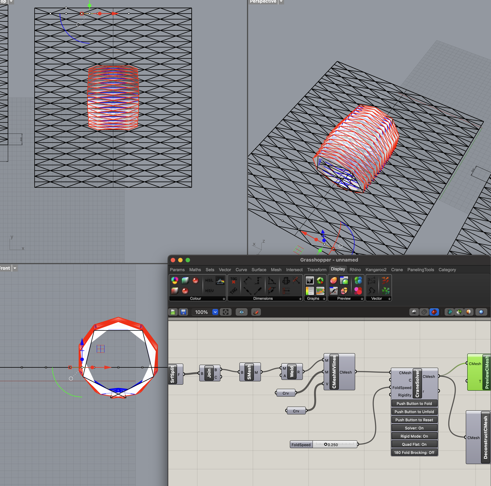
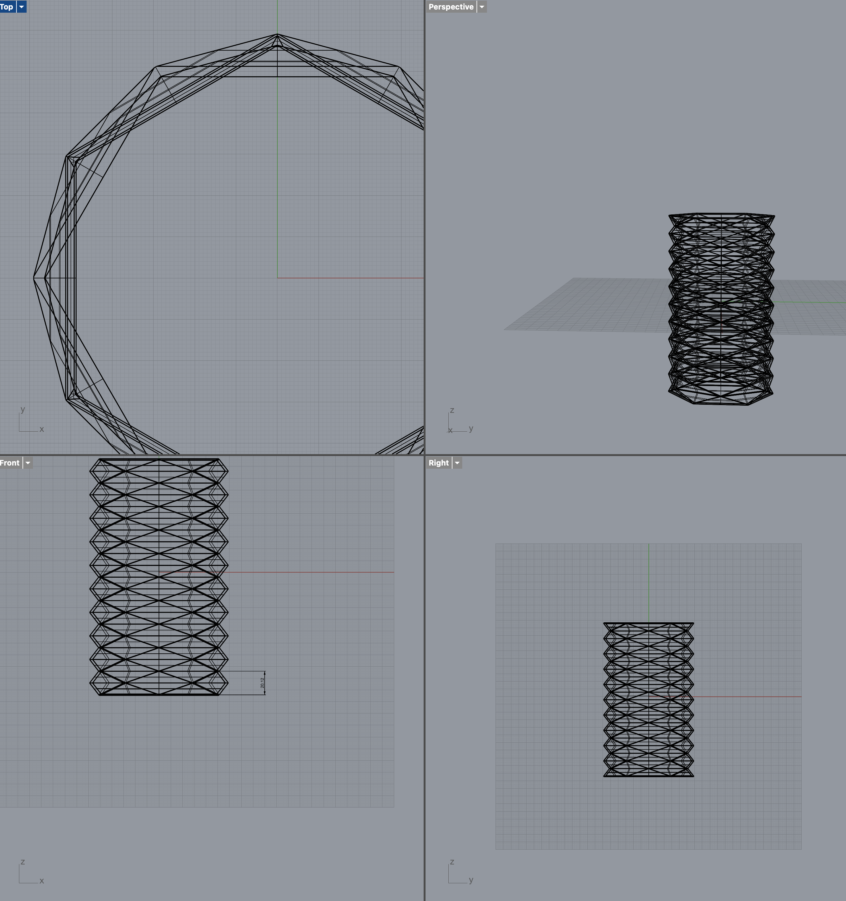

# 2024-11-21

## Second prototypes

|  |  |
| ---------------------------------- | ---------------------------------- |

### Rhino design

## Interaction

### Input

#### Sound

- Volume
- Frequency

### Output

#### Movement

- Speed
- Direction
- Rotation
- Position

#### Color

- RGB
- Brightness

### Interaction Mapping Table (~ing)

| **Input**                     | **Control Point Adjustment**                                                          | **Output**              |
| ----------------------------- | ------------------------------------------------------------------------------------- | ----------------------- |
| **Sound: Volume**             | Adjusts the height or bending angle of each point on the paper lines                  | **Movement: Speed**     |
| **Sound: Frequency**          | Moves specific control points to create pattern changes in the paper lines            | **Movement: Direction** |
| **Sound: Volume + Frequency** | Creates complex wave patterns by simultaneously adjusting multiple points             | **Movement: Rotation**  |
| **Color: RGB**                | Changes the color of the points (paper lines are tinted, synchronized with movements) | **Movement: Position**  |
| **Color: Brightness**         | Adjusts the wave intensity and visual emphasis according to brightness changes        | **Visual Feedback**     |

## Reference

- https://www.youtube.com/watch?v=ar7dMtsA-dY
- https://parametrichouse.com/origami-with-crane/
- https://en.wikipedia.org/wiki/Yoshimura_buckling
