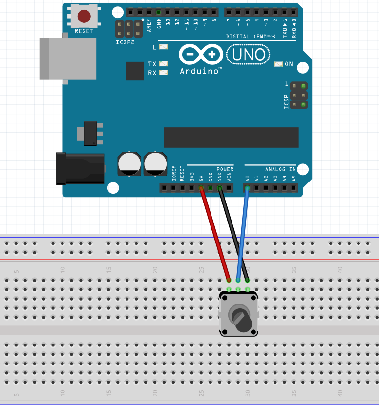
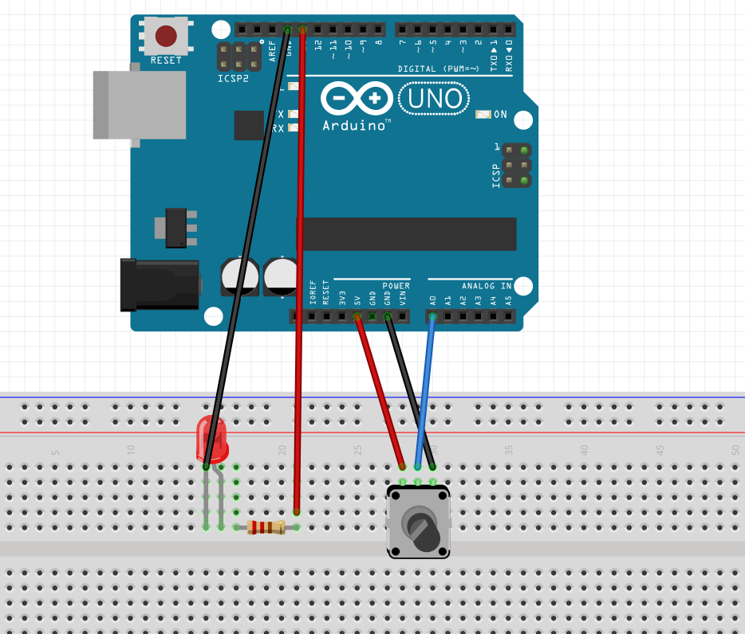
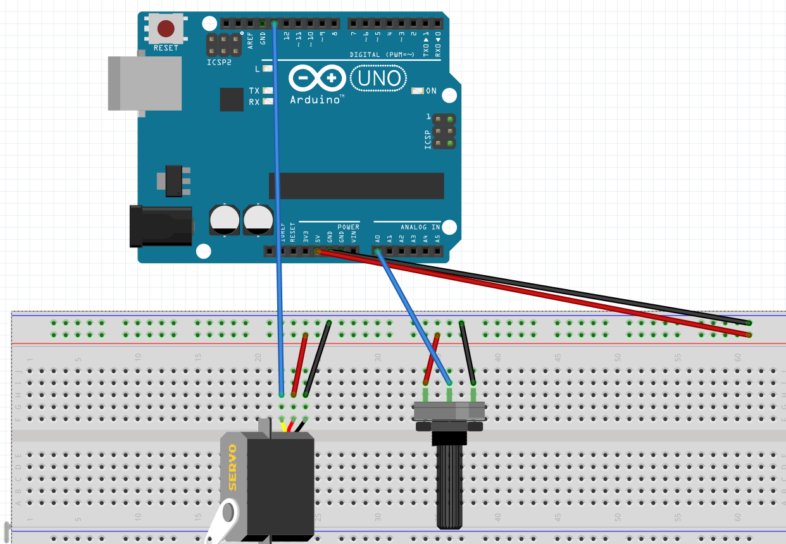
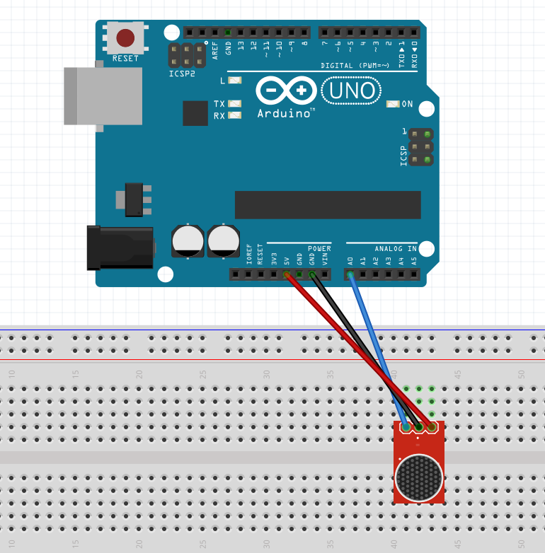
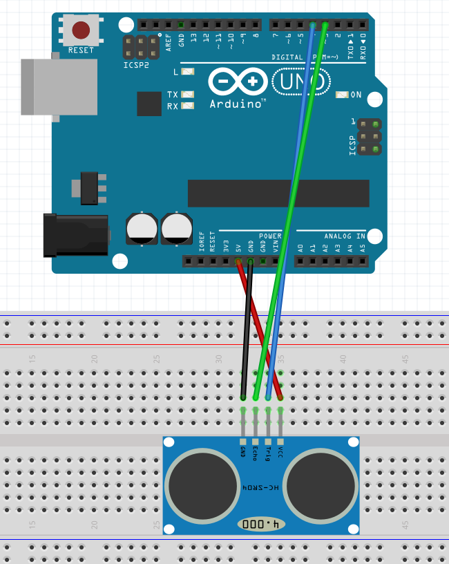

# 2024-11-25

## Electronics

### Potentiometer

Potentiometer is a three-terminal resistor with a sliding or rotating contact that forms an adjustable voltage divider. If only two terminals are used, one end and the wiper, it acts as a variable resistor or rheostat.

|  |  |
| ------------------------------- | --------------------------------- |

```arduino
// arduino code
void setup() {
  // put your setup code here, to run once:
  Serial.begin(9600);
}

void loop() {
  // put your main code here, to run repeatedly:
  int a0 = analogRead(A0);

  //convert analog input to voltage in millivolts
  long voltage = map(a0, 0, 1023, 0, 5000);

  float volts = voltage / 1000;

  Serial.print(a0);
  Serial.print("\t");
  Serial.print(voltage);
  Serial.print(" mV\t\t");
  Serial.print(volts);
  Serial.println(" V");
  delay(100);
}

```

```processing
// processing code
import processing.serial.*;

String line;
int val;
Serial myPort;

void setup() {
  size(200,500);
  println(Serial.list());

  String portName = Serial.list()[Serial.list().length - 1];
  myPort = new Serial(this, "/dev/tty.usbserial-A5069RR4", 9600);

}

void draw() {
  if(myPort.available() > 0) {
    line = myPort.readStringUntil(10);

    if(line != null) {

      String[] list = split(line, "\t");
      if(list.length > 1){
        println(list[0]);
        val = Integer.parseInt(list[0]);
        println(val);
      }
    }
  }
  background(255);
  if(val == 0 ){
    fill(0);
  } else {
    fill(204);
  }
  rect(50,map(val, 0, 1023, 0, height - 100),100,100);
}


```

### Potentiometer with LED



```arduino
#define LED_PIN 13
int lum = 15;

void setup() {
  pinMode(LED_PIN, OUTPUT);
}
void loop() {
  // put your main code here, to run repeatedly:
  int a0 = analogRead(A0);

  lum = map(a0, 0, 1023, 0, 20);

  digitalWrite(LED_PIN, HIGH);
  delay(lum);
  digitalWrite(LED_PIN, LOW);
  delay(20 - lum);
}
```

### Servo Motor

A servo motor is a rotary actuator that allows for precise control of angular position. It consists of a motor coupled to a sensor for position feedback.



```arduino
#include <Servo.h>   // include Arduino Servo library

Servo servo;       // create servo object to control a servo

#define PotPin    A0   // define potentiometer output pin connection
#define ServoPin  13    // define Servo control pin connection
int val;

void setup() {
  servo.attach(ServoPin);
  Serial.begin(9600);
}

void loop() {
  val = analogRead(PotPin);
  int angle = map(val, 0, 1023, 0, 180);
  servo.write(angle);

  // uint16_t an = analogRead(PotPin);    // read analog data from potentiometer output

  // uint8_t angle = map(an, 0, 1023, 0, 180);   // scale previous value between 0 and 180 (angle form)

  // if ( angle != servo.read() )   // check if angle changed
  //   servo.write(angle);          // set new servo motor angle

  delay(10);                     // waits for the servo to get there

}
```

### Soldering

Soldering is a process in which two or more items are joined together by melting and putting a filler metal (solder) into the joint, the filler metal having a lower melting point than the adjoining metal.

### Sound Sensor

A sound sensor is a device that detects sound waves and converts them into electrical signals. It can be used to detect the presence or absence of sound, measure sound intensity, or analyze sound frequencies.



```arduino
#include <arduinoFFT.h>
#include <Servo.h> // include Arduino Servo library

// 핀 설정
#define MicPin A0

// FFT 설정
#define SAMPLES 128             // 샘플 개수
#define SAMPLING_FREQUENCY 4000 // 샘플링 주파수(Hz)


// FFT 배열
float vReal[SAMPLES];
float average;

void setup() {
  servo.attach(ServoPin);
  Serial.begin(115200);
}

void loop() {
  // 1. 아날로그 입력 읽기
  for (int i = 0; i < SAMPLES; i++) {
    vReal[i] = analogRead(MicPin); // 마이크 값 읽기
    // Serial.println(vReal[i]);
    delayMicroseconds(1000000 / SAMPLING_FREQUENCY);
  }

  // 3. 소리 세기 계산 (RMS)
  float sum = 0;
  float sum2 = 0;
  for (int i = 0; i < SAMPLES; i++) {
    sum += vReal[i];
    sum2 += (vReal[i] - average) * (vReal[i] - average);
  }
   average = sum / SAMPLES;
  float volume = sqrt(sum2 / SAMPLES); // 소리 세기
  // Serial.print("Volume: ");
  // Serial.print(average);
  // Serial.print("\t");
  Serial.print(volume);
  Serial.print("\t");
  Serial.print(30);
  // Serial.print(volume - average);
  Serial.println();


}

```

### Ultrasonic Sensor

An ultrasonic sensor is a device that uses sound waves to measure distance. It emits a sound wave and measures the time it takes for the wave to bounce back, allowing it to calculate the distance to an object.



```arduino
const int TRIG_PIN = 4; // Arduino pin connected to Ultrasonic Sensor's TRIG pin
const int ECHO_PIN = 3; // Arduino pin connected to Ultrasonic Sensor's ECHO pin
const int LED_PIN  = 8; // Arduino pin connected to LED's pin
const int DISTANCE_THRESHOLD = 50; // centimeters

// variables will change:
float duration_us, distance_cm;

void setup() {
  Serial.begin (9600);       // initialize serial port
  pinMode(TRIG_PIN, OUTPUT); // set arduino pin to output mode
  pinMode(ECHO_PIN, INPUT);  // set arduino pin to input mode
  pinMode(LED_PIN, OUTPUT);  // set arduino pin to output mode
}

void loop() {
  // generate 10-microsecond pulse to TRIG pin
  digitalWrite(TRIG_PIN, HIGH);
  delayMicroseconds(10);
  digitalWrite(TRIG_PIN, LOW);

  // measure duration of pulse from ECHO pin
  duration_us = pulseIn(ECHO_PIN, HIGH);
  // calculate the distance
  distance_cm = 0.017 * duration_us;

  if(distance_cm < DISTANCE_THRESHOLD)
    digitalWrite(LED_PIN, HIGH); // turn on LED
  else
    digitalWrite(LED_PIN, LOW);  // turn off LED

  // print the value to Serial Monitor
  Serial.print("distance: ");
  Serial.print(distance_cm);
  Serial.println(" cm");

  delay(500);
}

```
