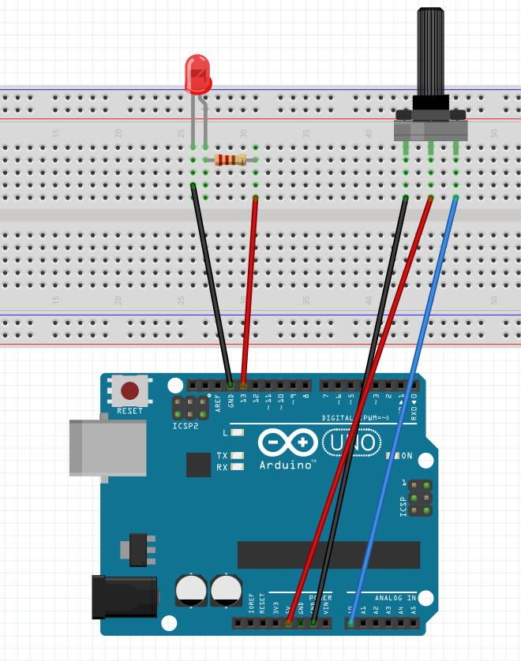
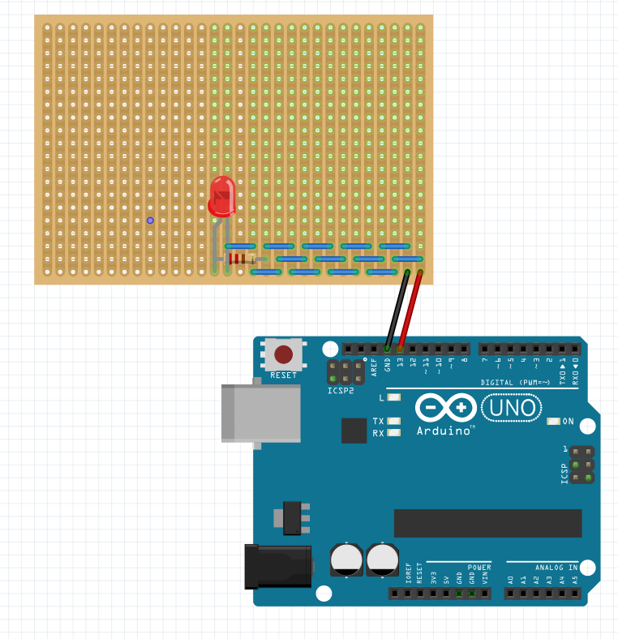

# 2024-11-29

## Electronics

### State Machine

A state machine is a mathematical model of computation. It is an abstract machine that can be in exactly one of a finite number of states at any given time. The state machine can change from one state to another in response to some inputs; the change from one state to another is called a transition. A state machine is defined by a list of its states, its initial state, and the conditions for each transition.



```arduino
#define LED_BUILTIN 13

bool barking = false;
void setup() {
  // put your setup code here, to run once:
  pinMode(LED_BUILTIN, OUTPUT);
  Serial.begin(9600);
}

void loop() {
  // put your main code here, to run repeatedly:
  int a0 = analogRead(A0);
  Serial.println(a0);

  barking = a0 < 500;

  if (barking) {
    // Blink
    digitalWrite(LED_BUILTIN, HIGH);
    delay(1000);
    digitalWrite(LED_BUILTIN, LOW);
    delay(1000);
  } else {
    // Glow the led
    float freq = 1.0 / 4;
    float intensity = sin(2 * PI * freq * millis() / 1000.0);
    Serial.println(intensity);

    int pulse = map(intensity * 1000, -1000, 1000, 0, 20);
    Serial.println(pulse);
    digitalWrite(LED_BUILTIN, HIGH);
    delay(pulse);
    digitalWrite(LED_BUILTIN, LOW);
    delay(20 - pulse);

  }
}

```

### Soldering Exercise



|  |  |  |
| ---------------------------------- | ---------------------------------- | ---------------------------------- |


### References

- https://www.youtube.com/watch?v=Fp37DPZVdRI
- https://blog.prossel.info/517-state-machine-arduino-demo/
- https://bitbucket.org/pierrerossel/state-machine-arduino-demo/src/master/
