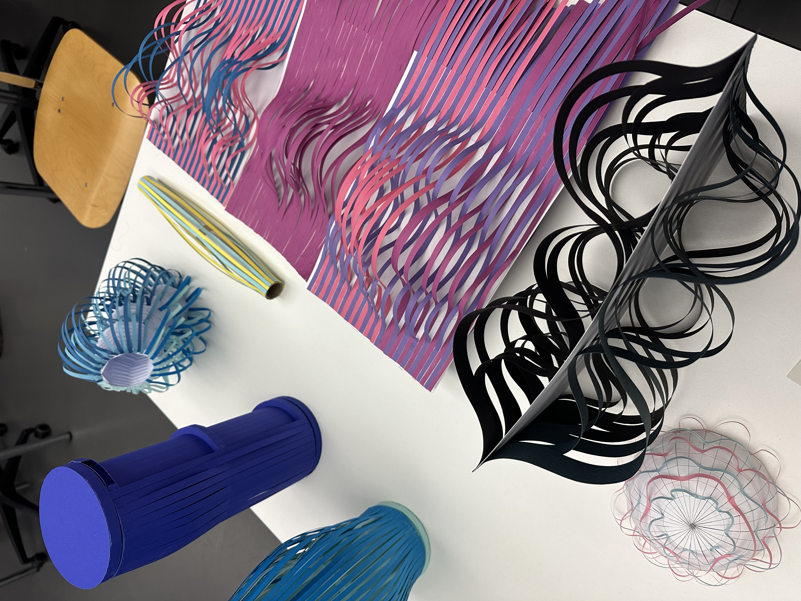
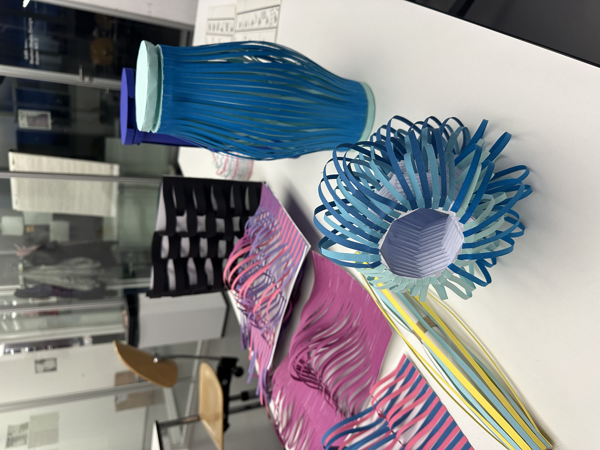
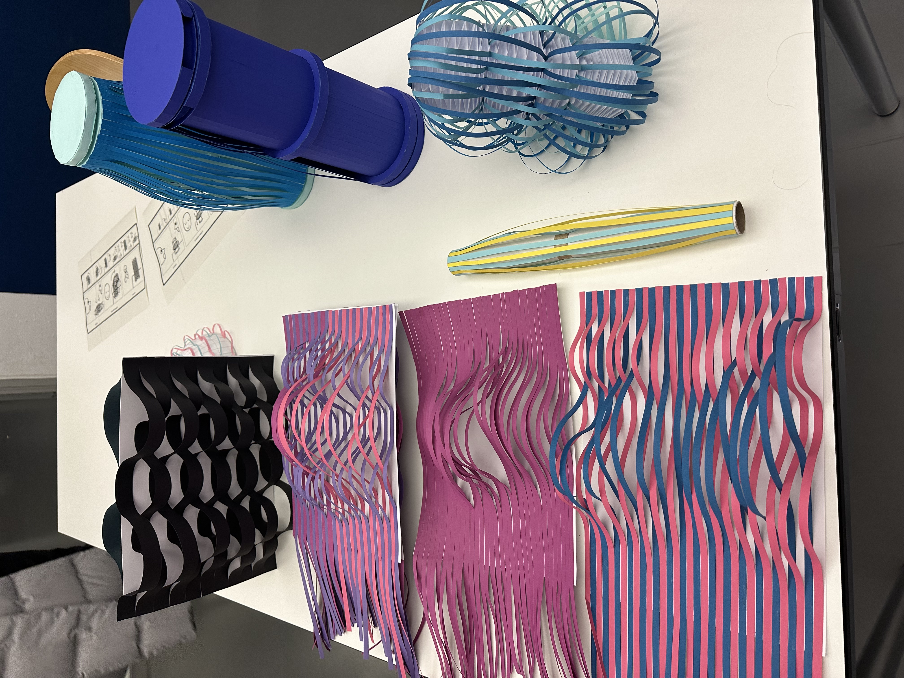
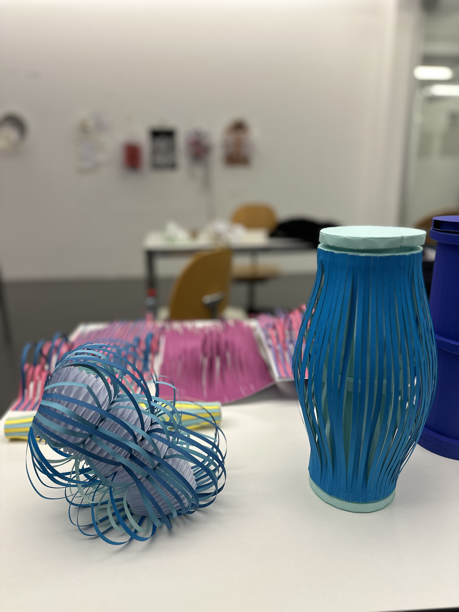
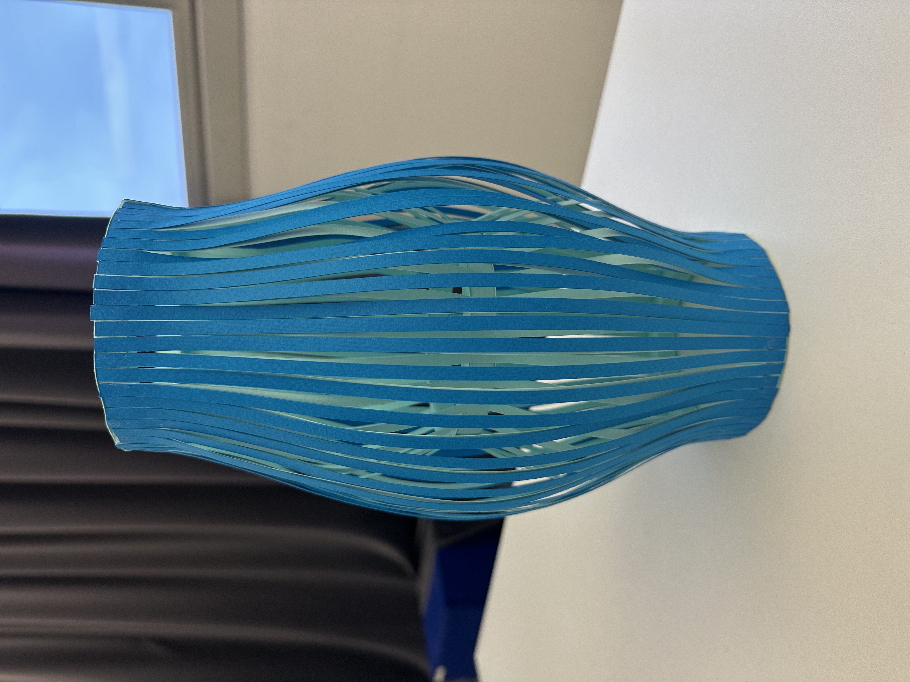
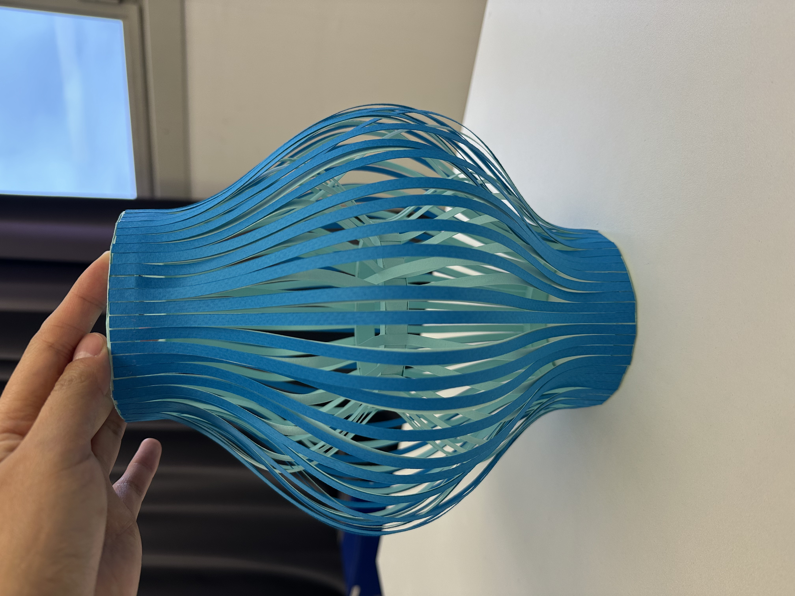

# 2024-12-05

## Feedback

|  |  |  |
| ----------------------------------- | ----------------------------------- | ----------------------------------- |

|  |  |  |
| ----------------------------------- | ----------------------------------- | ----------------------------------- |

Cats typically act on their own terms and don’t respond to humans as dogs do. Therefore, the interaction of this robot doesn’t need to be a direct 1:1 response. Instead, the robot can emulate the entertaining and whimsical behavior of a cat, which serves as a distraction and draws people’s attention while making them happy. (After all, isn’t this why we love cats?) For the input interaction, we will use a sound sensor, and for the output interaction, three servo motors will control the mechanism like a marionette, pulling a central ring to bend the structure in various directions. All electronic components will be housed at the base of the model, fabricated using either a 3D printer or MDF.

We will experiment with the first ring by making it smaller or larger to test if the upper part moves more freely. Alternatively, we could extend the position of the first ring to observe its effect. For added fun, the top layer will feature playful "hair." The rings themselves could be made using MDF or a 3D printer (finding a way to join them without using glue). Additionally, we’ll explore attaching the lines inside the first ring instead of outside to see if it changes the shape.

Lastly, we’ll create a 3D model and test different color combinations to find the most visually appealing design.

For the output motion, we’ll design around 10 movements. When triggered by sound, the robot will randomly execute one of these movements. This unpredictability will allow viewers to interpret the robot’s actions and craft their own narratives, which is the robot’s most significant charm.

---

### Materials

- 3 servo motors
- Thread, rubber bands, or elastic fishing line
- Paper (gradient or double-sided)

---

### To-Do List

- [x] 3D modeling (include colors)
  - [ ] Create multiple models with variations in the size and length of the first ring (and build prototypes).
  - [ ] Attach the lines inside the first ring and test.
  - [ ] Design playful hair for the top layer (and build a prototype).
  - [ ] Explore methods to fabricate the rings using MDF.
- [x] Connect thread or rubber bands to test pulling mechanisms.
- [ ] Design 10 motion patterns for the servo motors (3 or more motors).
- [ ] Connect and test the sound sensor.

---

### Rhino Workflow

1. Draw a curved line above the ring.
2. Copy the line at 5mm intervals.
3. Select two lines and use **Loft** to connect them.
4. Delete the original lines.
5. Select the surface and apply **Offset Surface** to add 2mm thickness.
6. Use **Polar Array** to replicate the surface 360° around the ring.

---

### Base Design

Fabricate using a 3D printer.
