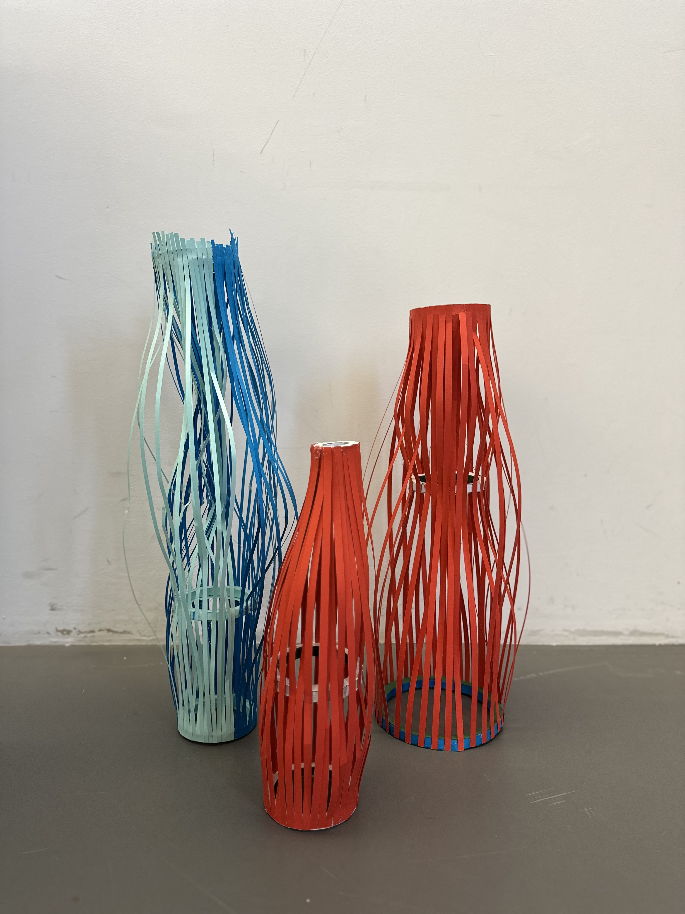
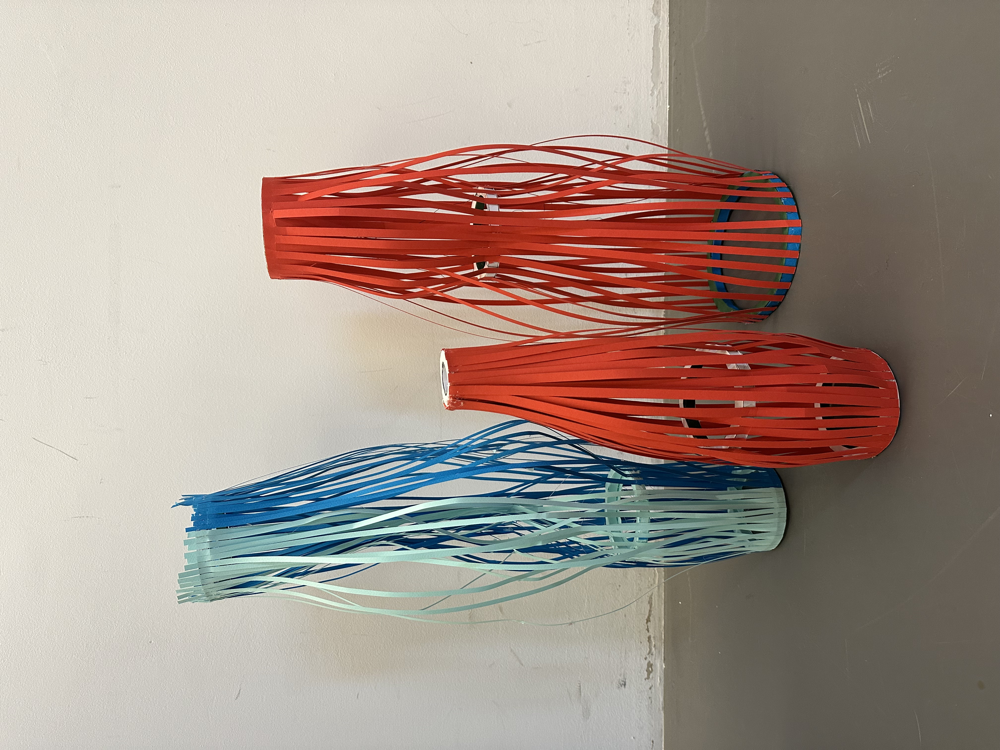

# 2024-12-10

## Servo motor test

I made a simple test code to control the servo motor with a button. The servo motor rotates 180 degrees and rotates back to the original position when the button is pressed. I used 4 buttons and 4 servo motors to test the code. The code is as follows:

```arduino
#include <Servo.h>

int buttonPinA = 13;
int buttonPinB = 12;
int buttonPinC = 10;
int buttonPinD = 9;


Servo myservo1;
Servo myservo2;
Servo myservo3;
Servo myservo4;


int pos1 = 0;
int pos2 = 0;
int pos3 = 0;
int pos4 = 0;
int maxAngle = 360;


void setup() {
  pinMode(buttonPinA, INPUT);
  pinMode(buttonPinB, INPUT);
  pinMode(buttonPinC, INPUT);
  pinMode(buttonPinD, INPUT);


  myservo1.attach(7);
  myservo2.attach(6);
  myservo3.attach(5);
  myservo4.attach(4);
}

void loop() {

  if (digitalRead(buttonPinA) == HIGH) {
    for (pos1 = 0; pos1 <= maxAngle; pos1 += 1) {
      myservo1.write(pos1);
      delay(3);
    }

    for (pos1 = maxAngle; pos1 > 0; pos1 -= 1) {
      myservo1.write(pos1);
      delay(3);
    }
  }

  if (digitalRead(buttonPinB) == HIGH) {
    for (pos2 = 0; pos2 <= maxAngle; pos2 += 1) {
      myservo2.write(pos2);
      delay(3);
    }

    for (pos2 = maxAngle; pos2 > 0; pos2 -= 1) {
      myservo2.write(pos2);
      delay(3);
    }
  }
}

```

## Paper prototype

I experimented with different paper prototypes to find perfect motion presets for the final prototype. I tried various shapes and sizes of paper to find the best motion presets. Here are some of the different paper prototypes I tried:

|  |  |
| ----------------------------------- | ----------------------------------- |
