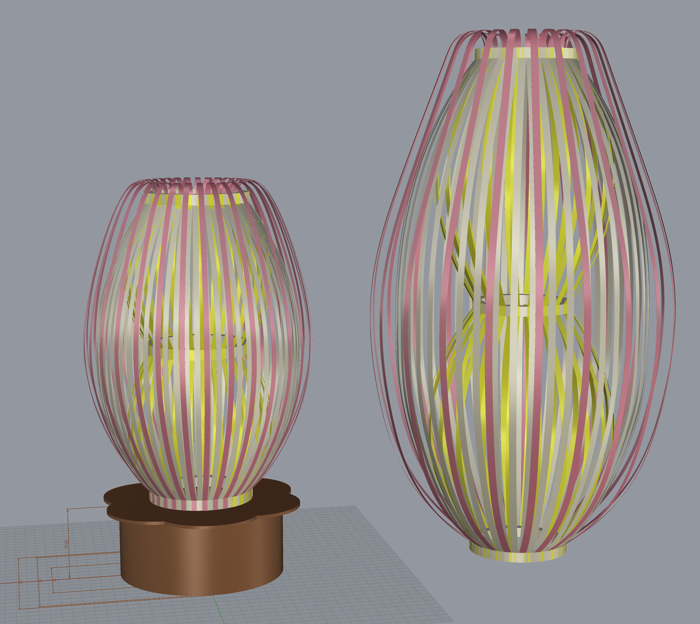

# 2024-12-11

## Final paper prototypes

### 1. `felimo-w_5-g_160-h_290-c_0.5-i_1_2`

### 2. `felimo-w_5-g_160-h_290-c_0.5-i_1_1`

- Inside lines : 240gsm
- Outside lines : 160gsm

|  |  |
| ----------------------------------- | ---------------------------------- |

### 3. `felimo-w_7-g_240-h_500-c_0.5-i_1_2`

|  |  |
| ----------------------------------- | ---------------------------------- |

### 4. `felimo-w_7-g_160-h_500-c_0.3-i_1_2`

- Inside lines : 240gsm
- Outside lines : 160gsm

|  |  |
| ----------------------------------- | ---------------------------------- |

### 5. `felimo-w_7-g_160-h_500-c_0.3-i_1_2 (extra ring)`

|  |  |
| ----------------------------------- | ---------------------------------- |

## 3D Model (Rhino)

|  |  |
| --------------------------------- | --------------------------------- |
