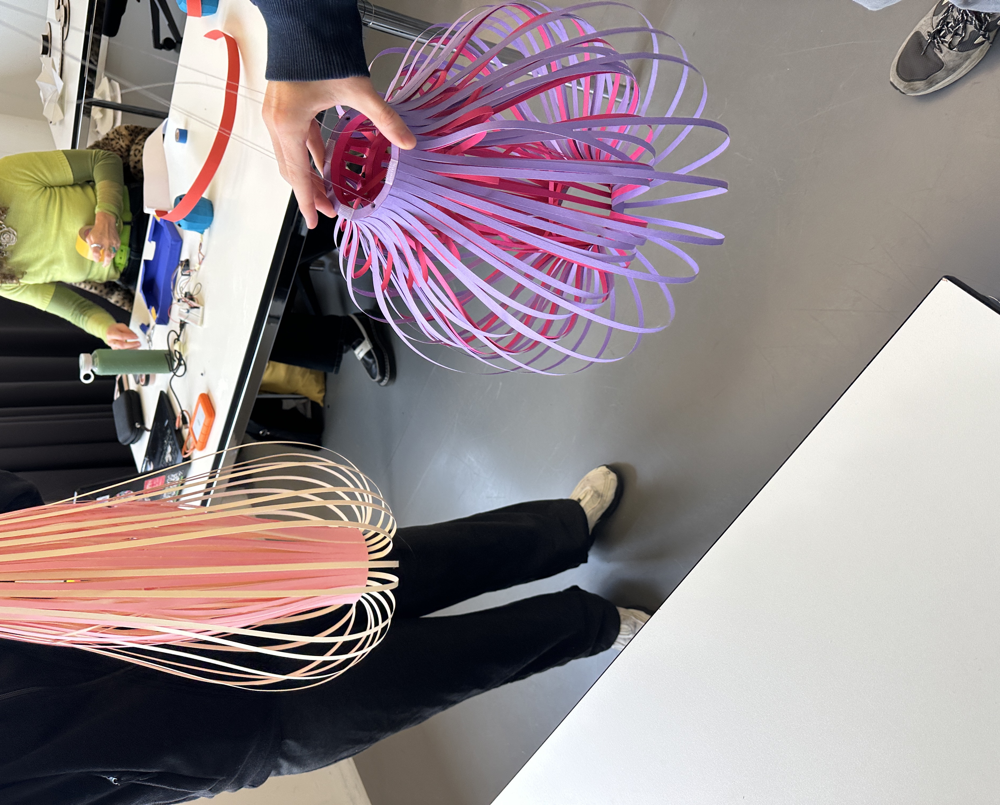
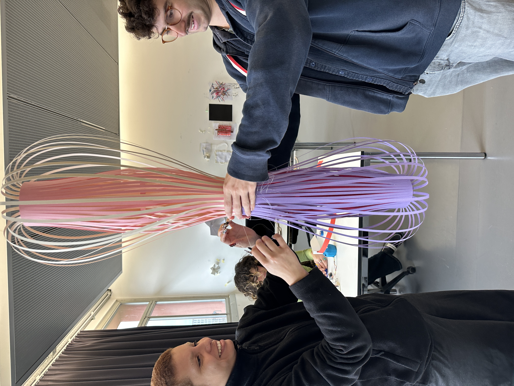
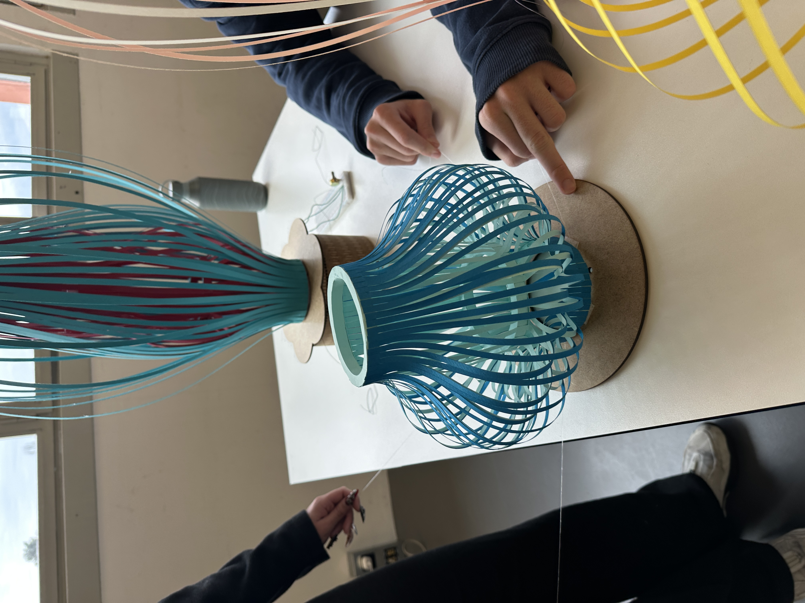
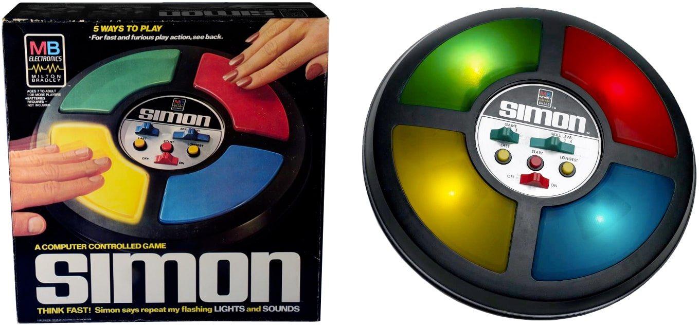

# 2024-12-18

## Feedback


|  |  |
| ---------------------------------- | ---------------------------------- |

|  |  |
| ---------------------------------- | ---------------------------------- |

|  |  |
| ---------------------------------- | ---------------------------------- |

|  |  |
| ---------------------------------- | ---------------------------------- |

- Animal
  - Jelli fish
  - Coral
  - Fish
- Scale
  - Small is better
  - Bigger one is for the ground
  - small one is for the table
- or Big scale that people can go inside and interact
- Big scale looks very fancy. small scale is more playful and interactive
- It looks like a musical instrument/lava lamp/kalimba/Joy stick
- Top part should be more touchable
- You could show Scanimation
- When they play with it, it's very satisfying (bouncing)
- If you pull the string, the light of prototypes changes
- audio reactive
- touch reactive
- Visual alarm clock (not sound) - which is relaxing and makes you wake up smoothly
- they just tried to talk to it
- they want to see a crazy movement
- touch and moving itself

## References

- Soto optical art
  - 
- Iris van herpen
  - 
- Zara home origami lantern
  - 
- Simon game
  - 
- Scanimation
  - 
  - moire effect

## Servo motor with potentiometer

```arduino
#include <Servo.h>

// 서보모터 객체 선언
Servo servo1;
Servo servo2;
Servo servo3;
Servo servo4;

// 서보모터 핀 설정
const int servoPin1 = 12;
const int servoPin2 = 13;
const int servoPin3 = 9;
const int servoPin4 = 8;

// 포텐셔미터 핀 설정
const int potPin = A0; // 포텐셔미터 아날로그 핀

void setup() {
    // 서보모터 핀 연결
    servo1.attach(servoPin1);
    servo2.attach(servoPin2);
    servo3.attach(servoPin3);
    servo4.attach(servoPin4);

    // 초기 각도 설정 (0도)
    servo1.write(0);
    servo2.write(0);
    servo3.write(0);
    servo4.write(0);

    Serial.begin(9600);
}

void loop() {
    // 패턴 선택을 위한 포텐셔미터 값 읽기
    int potValue = analogRead(potPin); // 0 ~ 1023 값 반환

    if (potValue <= 300) {
    stopAllServos();
    return; // loop의 나머지 코드 실행 중지
    }

    // 포텐셔미터 값이 300 초과일 경우 움직임 패턴 실행
    int pattern = map(potValue, 301, 1023, 1, 10);

    Serial.print("Potentiometer Value: ");
    Serial.print(potValue);
    Serial.print(" -> Executing Pattern: ");
    Serial.println(pattern);

    // 선택된 패턴 실행 (반복)
    switch (pattern) {
        case 1:
            while (analogRead(potPin) == potValue) movementPattern1();
            break;
        case 2:
            while (analogRead(potPin) == potValue) movementPattern2();
            break;
        case 3:
            while (analogRead(potPin) == potValue) movementPattern3();
            break;
        case 4:
            while (analogRead(potPin) == potValue) movementPattern4();
            break;
        case 5:
            while (analogRead(potPin) == potValue) movementPattern5();
            break;
        case 6:
            while (analogRead(potPin) == potValue) movementPattern6();
            break;
        case 7:
            while (analogRead(potPin) == potValue) movementPattern7();
            break;
        case 8:
            while (analogRead(potPin) == potValue) movementPattern8();
            break;
        case 9:
            while (analogRead(potPin) == potValue) movementPattern9();
            break;
        case 10:
            while (analogRead(potPin) == potValue) movementPattern10();
            break;
    }
}

// 서보모터 반복 움직임 패턴
void movementPattern1() {
    repeatMove(servo1, 0, 45, 20);
    repeatMove(servo2, 0, 90, 15);
    repeatMove(servo3, 0, 60, 25);
    repeatMove(servo4, 0, 120, 18);
}

void movementPattern2() {
    repeatMove(servo1, 0, 30, 15);
    repeatMove(servo2, 0, 150, 20);
    repeatMove(servo3, 0, 45, 10);
    repeatMove(servo4, 0, 135, 12);
}

// 다른 movementPattern 함수들은 동일한 구조로 패턴을 정의합니다.
// 패턴은 서보모터 4개가 번갈아 움직이며 반복됩니다.

void movementPattern3() {
    repeatMove(servo1, 0, 90, 10);
    repeatMove(servo2, 0, 180, 12);
}
void movementPattern4() {
    repeatMove(servo3, 0, 60, 15);
    repeatMove(servo4, 0, 135, 10);
}
void movementPattern5() {
    repeatMove(servo1, 0, 180, 8);
    repeatMove(servo2, 0, 90, 8);
}
void movementPattern6() {
    repeatMove(servo3, 0, 120, 12);
    repeatMove(servo4, 0, 180, 10);
}
void movementPattern7() {
    repeatMove(servo1, 0, 30, 10);
    repeatMove(servo2, 0, 60, 12);
}
void movementPattern8() {
    repeatMove(servo3, 0, 90, 15);
    repeatMove(servo4, 0, 135, 8);
}
void movementPattern9() {
    repeatMove(servo1, 0, 45, 20);
    repeatMove(servo2, 0, 60, 15);
}
void movementPattern10() {
    repeatMove(servo3, 0, 180, 5);
    repeatMove(servo4, 0, 90, 10);
}

// 서보모터 움직임 반복 함수
void repeatMove(Servo motor, int startAngle, int endAngle, int speed) {
    smoothMove(motor, startAngle, endAngle, speed); // start -> end
    smoothMove(motor, endAngle, startAngle, speed); // end -> start
}

// 서보모터 부드러운 움직임 함수
void smoothMove(Servo motor, int startAngle, int endAngle, int speed) {
    int step = (startAngle < endAngle) ? 1 : -1;
    for (int pos = startAngle; pos != endAngle; pos += step) {
    motor.write(pos);
    delay(speed); // 속도 조절
    }
    motor.write(endAngle);
}

// 서보모터 정지 함수
void stopAllServos() {
    servo1.write(0); // 초기 각도로 설정
    servo2.write(0);
    servo3.write(0);
    servo4.write(0);
    Serial.println("Potentiometer value is too low. Stopping all movements.");
}

```
