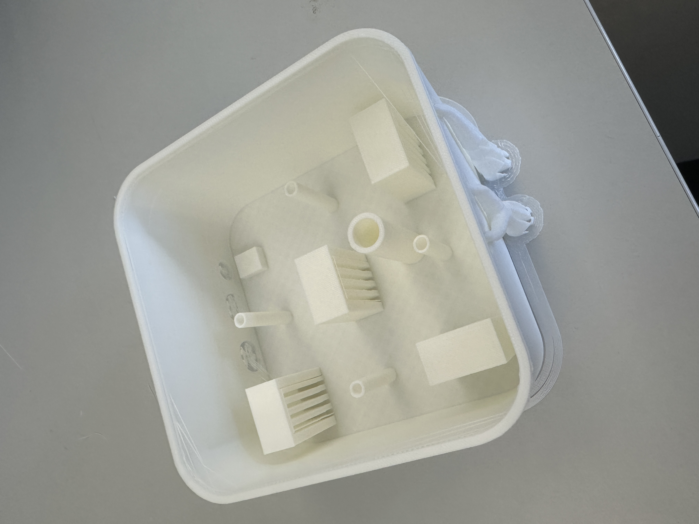

# 2025-01-10

## Final paper prototype

|  |  |
| ---------------------------------- | ---------------------------------- |

|  |  |
| ---------------------------------- | ---------------------------------- |

## 3d Box for electronics

### First try

|  |  |
| ---------------------------------- | ---------------------------------- |

### Second try

|  |  |  |
| ---------------------------------- | ---------------------------------- | ---------------------------------- |

## Circuit diagram


## Arduino code

```arduino

#include <Servo.h>
#include <math.h>  // RMS 계산에 필요

// 서보모터 객체 선언
Servo servo1;
Servo servo2;
Servo servo3;
Servo servo4;

// 서보모터 핀 설정
const int servoPin1 = 12;
const int servoPin2 = 13;
const int servoPin3 = 9;
const int servoPin4 = 8;
const int MicPin = A0;
const int trigPin = 6;
const int echoPin = 5;

float duration_us, distance_cm;

#define SAMPLES 128  // 샘플 개수
int samples[SAMPLES];

void setup() {
  // 서보모터 핀 연결
  servo1.attach(servoPin1);
  servo2.attach(servoPin2);
  servo3.attach(servoPin3);
  servo4.attach(servoPin4);

  // 초기 각도 설정
  servo1.write(0);
  servo2.write(0);
  servo3.write(0);
  servo4.write(0);

  pinMode(trigPin, OUTPUT);
  pinMode(echoPin, INPUT);

  Serial.begin(115200);  // 시리얼 통신 초기화
}

void loop() {
  // 초음파 센서로 거리 측정
  digitalWrite(trigPin, LOW);
  delayMicroseconds(2);
  digitalWrite(trigPin, HIGH);
  delayMicroseconds(10);
  digitalWrite(trigPin, LOW);

  duration_us = pulseIn(echoPin, HIGH);
  distance_cm = duration_us * 0.034 / 2;

  // 사운드 센서 값 측정
  float rmsValue = getSoundLevel();

  Serial.print("Distance: ");
  Serial.print(distance_cm);
  Serial.print(" cm | Sound Level: ");
  Serial.println(rmsValue);

  // 조건에 따라 움직임 트리거
  if (distance_cm > 60 || distance_cm == 0) {
    stopAllServos();
    return;
  }

  if (rmsValue > 50 && distance_cm < 30) {
    movementPattern1();
  } else if (rmsValue <= 50 && distance_cm < 30) {
    movementPattern2();
  } else if (rmsValue > 50 && distance_cm >= 30) {
    movementPattern3();
  } else {
    movementPattern4();
  }

  delay(200);  // 안정화 대기
}

// 서보모터 움직임 패턴 정의
void movementPattern1() {
  repeatMove(servo1, 0, 45, 25);
  repeatMove(servo2, 0, 45, 25);
}

void movementPattern2() {
  repeatMove(servo3, 0, 60, 25);
  repeatMove(servo4, 0, 60, 25);
}

void movementPattern3() {
  repeatMove(servo1, 0, 80, 10);
  repeatMove(servo2, 0, 80, 10);
  repeatMove(servo3, 0, 90, 10);
  repeatMove(servo4, 0, 90, 10);
}

void movementPattern4() {
  repeatMove(servo1, 0, 120, 5);
  repeatMove(servo2, 0, 120, 5);
  repeatMove(servo3, 0, 120, 5);
  repeatMove(servo4, 0, 120, 5);
}

// 서보모터 반복 움직임 함수
void repeatMove(Servo &motor, int startAngle, int endAngle, int speed) {
  smoothMove(motor, startAngle, endAngle, speed);
  smoothMove(motor, endAngle, startAngle, speed);
}

// 서보모터 부드러운 움직임 함수
void smoothMove(Servo &motor, int startAngle, int endAngle, int speed) {
  int step = (startAngle < endAngle) ? 1 : -1;
  for (int pos = startAngle; pos != endAngle; pos += step) {
    motor.write(pos);
    delay(speed);
  }
  motor.write(endAngle);
}

// 서보모터 정지
void stopAllServos() {
  servo1.write(0);
  servo2.write(0);
  servo3.write(0);
  servo4.write(0);
}

// 사운드 센서 값 계산
float getSoundLevel() {
  int sum = 0;
  for (int i = 0; i < 10; i++) { // 샘플링
    int sound = analogRead(MicPin);
    sum += sound;
    delay(10);
  }
  return sum / 10.0; // 평균 소리 레벨 반환
}

```
