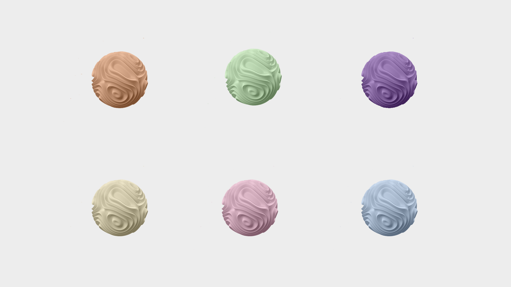

# Training research

## On the scalability and circularity of research

Book: S,M,L,XL by Rem Koolhaas and Bruce Mau

### Fritz Haller (Architect)

USM: Universal Space Module  
USM is a furniture brand in Swiss.

Fritz Haller designed the USM Haller system in 1963. The system is based on a few simple elements that can be combined in a variety of ways to create a piece of furniture that is both functional and aesthetically pleasing. The USM Haller system is still in production today and is considered a classic of modern design.

---

USM Haller's MINI and MIDI are two variants of a modular steel construction system designed by Swiss architect Fritz Haller. This system was developed to efficiently construct buildings of various sizes and purposes.

#### MINI

Mainly used in one- to two-story buildings, it has been used for a variety of purposes, including residential houses, offices, school pavilions, laboratories, and exhibition halls. The system has a pole spacing of up to 8.4 meters and can be freely expanded horizontally. Additionally, the exterior wall panels are removable so you can easily change them as needed.

#### MIDI

Suitable for industrial buildings with two or more floors, and has been used in the construction of schools, offices, laboratories, hospitals, etc. This system integrates the building facility's piping system as part of the overall structure, enabling efficient space utilization and facility placement.

These modular systems responded to a variety of construction needs by providing short construction periods, easy expansion and modification, and the flexibility to dismantle and reassemble.

- Whole Earth Catalog (1968)
- The club of Rome
  - the limits to growth (1972)

### Nina Paim

- Bikini books

## Maximise the potential of the research

- remind yourself about aspects of scale
- consider small steps
- evaluate and re-evaluate priorities
- relate research to your practice
- be not afraid of administrative issues
- suggest change
- embrace obsession
- own your research
- share it (doubts and results)
- accept failure and enjoy detours
- kill the deadline
- take your time & stay patient
- finish the project

Book: The minimal intervention by Lucius Burckhardt

## Chewing gum workshop

"A new chewing gum designed as an educational tool to inspire creativity and teach people how to think innovatively."

This gum is very soft and stretchy. And when it combines with oxygen outside, it hardens in a short time. People can use this gum to create creative sculptures and it can be used for children's creative education.
